# 应用实践层理论分类图

## 一、层次概述

应用实践层是理论体系的最高层次，位于系统理论层之上。它负责将理论成果转化为实际应用，包括编程语言、软件工程、人工智能、数据科学等具体应用领域，是理论与实践结合的桥梁。

## 二、理论分类结构

```mermaid
graph TD
    A[应用实践层] --> B[编程语言]
    A --> C[软件工程]
    A --> D[人工智能]
    A --> E[数据科学]
    A --> F[网络技术]
    A --> G[系统应用]
    
    B --> B1[函数式编程]
    B --> B2[面向对象编程]
    B --> B3[逻辑编程]
    B --> B4[并发编程]
    B --> B5[领域特定语言]
    
    C --> C1[软件架构]
    C --> C2[设计模式]
    C --> C3[软件测试]
    C --> C4[软件维护]
    C --> C5[软件项目管理]
    
    D --> D1[机器学习]
    D --> D2[深度学习]
    D --> D3[自然语言处理]
    D --> D4[计算机视觉]
    D --> D5[知识表示与推理]
    
    E --> E1[数据分析]
    E --> E2[数据挖掘]
    E --> E3[大数据处理]
    E --> E4[数据可视化]
    E --> E5[数据工程]
    
    F --> F1[网络协议]
    F --> F2[分布式系统]
    F --> F3[云计算]
    F --> F4[物联网]
    F --> F5[网络安全]
    
    G --> G1[操作系统]
    G --> G2[数据库系统]
    G --> G3[嵌入式系统]
    G --> G4[实时系统]
    G --> G5[移动系统]
```

## 三、各子分支详细描述

### 3.1 编程语言

#### 3.1.1 函数式编程 (Functional Programming)

- **定义**: 以函数为基本计算单位的编程范式
- **核心概念**: 纯函数、不可变性、高阶函数、函数组合
- **性质**: 引用透明性、无副作用、可组合性、可测试性
- **应用领域**: 数据处理、并发编程、Web开发、金融系统

#### 3.1.2 面向对象编程 (Object-Oriented Programming)

- **定义**: 以对象为基本单位的编程范式
- **核心概念**: 类、对象、继承、封装、多态
- **性质**: 封装性、继承性、多态性、抽象性
- **应用领域**: 企业应用、桌面应用、游戏开发、系统软件

#### 3.1.3 逻辑编程 (Logic Programming)

- **定义**: 基于逻辑推理的编程范式
- **核心概念**: 谓词、规则、查询、回溯、统一
- **性质**: 声明性、逻辑性、可推理性、非确定性
- **应用领域**: 人工智能、专家系统、自然语言处理、定理证明

#### 3.1.4 并发编程 (Concurrent Programming)

- **定义**: 处理多个任务同时执行的编程方法
- **核心概念**: 线程、进程、同步、互斥、死锁
- **性质**: 并发性、并行性、同步性、异步性
- **应用领域**: 高性能计算、网络服务、实时系统、多核系统

#### 3.1.5 领域特定语言 (Domain-Specific Languages)

- **定义**: 针对特定应用领域设计的编程语言
- **核心概念**: 领域模型、语法设计、语义定义、工具支持
- **性质**: 专业性、简洁性、可读性、可维护性
- **应用领域**: 配置管理、数据处理、建模工具、业务规则

### 3.2 软件工程

#### 3.2.1 软件架构 (Software Architecture)

- **定义**: 软件系统的整体结构和组织方式
- **核心概念**: 架构模式、组件设计、接口定义、质量属性
- **性质**: 系统性、层次性、可扩展性、可维护性
- **应用领域**: 大型系统设计、企业应用、云服务、微服务

#### 3.2.2 设计模式 (Design Patterns)

- **定义**: 解决常见设计问题的可重用解决方案
- **核心概念**: 模式分类、模式应用、模式组合、反模式
- **性质**: 可重用性、可扩展性、可维护性、标准化
- **应用领域**: 面向对象设计、框架开发、代码重构、系统设计

#### 3.2.3 软件测试 (Software Testing)

- **定义**: 验证软件质量和正确性的过程
- **核心概念**: 测试策略、测试用例、测试执行、缺陷管理
- **性质**: 系统性、可重复性、可度量性、有效性
- **应用领域**: 质量保证、缺陷预防、回归测试、性能测试

#### 3.2.4 软件维护 (Software Maintenance)

- **定义**: 软件交付后的修改和完善过程
- **核心概念**: 维护类型、变更管理、版本控制、配置管理
- **性质**: 持续性、适应性、改进性、稳定性
- **应用领域**: 系统升级、缺陷修复、功能增强、性能优化

#### 3.2.5 软件项目管理 (Software Project Management)

- **定义**: 管理软件开发项目的计划、执行和控制
- **核心概念**: 项目计划、资源管理、风险管理、质量管理
- **性质**: 计划性、控制性、协调性、目标导向
- **应用领域**: 项目交付、团队管理、成本控制、进度管理

### 3.3 人工智能

#### 3.3.1 机器学习 (Machine Learning)

- **定义**: 让计算机从数据中学习并改进性能的技术
- **核心概念**: 监督学习、无监督学习、强化学习、特征工程
- **性质**: 学习能力、泛化能力、适应性、可解释性
- **应用领域**: 推荐系统、金融风控、医疗诊断、智能客服

#### 3.3.2 深度学习 (Deep Learning)

- **定义**: 基于深度神经网络的机器学习方法
- **核心概念**: 神经网络、反向传播、梯度下降、正则化
- **性质**: 表示学习、端到端学习、大规模数据处理
- **应用领域**: 图像识别、语音识别、自然语言处理、自动驾驶

#### 3.3.3 自然语言处理 (Natural Language Processing)

- **定义**: 让计算机理解和生成人类语言的技术
- **核心概念**: 语言模型、词向量、句法分析、语义理解
- **性质**: 语言理解、语言生成、多语言支持、上下文感知
- **应用领域**: 机器翻译、智能问答、文本摘要、情感分析

#### 3.3.4 计算机视觉 (Computer Vision)

- **定义**: 让计算机理解和分析视觉信息的技术
- **核心概念**: 图像处理、特征提取、目标检测、图像分割
- **性质**: 视觉理解、实时处理、鲁棒性、准确性
- **应用领域**: 人脸识别、物体检测、医学影像、自动驾驶

#### 3.3.5 知识表示与推理 (Knowledge Representation and Reasoning)

- **定义**: 表示和推理知识的符号化方法
- **核心概念**: 本体论、语义网、规则推理、逻辑推理
- **性质**: 符号性、可解释性、可推理性、可扩展性
- **应用领域**: 专家系统、智能搜索、语义分析、决策支持

### 3.4 数据科学

#### 3.4.1 数据分析 (Data Analysis)

- **定义**: 从数据中提取有用信息的科学过程
- **核心概念**: 描述性分析、探索性分析、推断性分析、预测性分析
- **性质**: 数据驱动、统计性、可解释性、可验证性
- **应用领域**: 商业智能、科学研究、政策制定、市场分析

#### 3.4.2 数据挖掘 (Data Mining)

- **定义**: 从大量数据中发现隐藏模式和关系的过程
- **核心概念**: 关联规则、分类、聚类、异常检测
- **性质**: 模式发现、预测性、可扩展性、自动化
- **应用领域**: 客户分析、欺诈检测、推荐系统、风险管理

#### 3.4.3 大数据处理 (Big Data Processing)

- **定义**: 处理超大规模数据集的技术和方法
- **核心概念**: 分布式计算、流处理、批处理、实时分析
- **性质**: 可扩展性、高性能、容错性、实时性
- **应用领域**: 日志分析、用户行为分析、实时监控、智能城市

#### 3.4.4 数据可视化 (Data Visualization)

- **定义**: 将数据转换为图形化表示的技术
- **核心概念**: 图表类型、交互设计、视觉编码、信息密度
- **性质**: 直观性、交互性、美观性、信息性
- **应用领域**: 商业报告、科学可视化、仪表板、数据故事

#### 3.4.5 数据工程 (Data Engineering)

- **定义**: 构建和维护数据处理基础设施的工程实践
- **核心概念**: 数据管道、ETL、数据仓库、数据湖
- **性质**: 可靠性、可扩展性、可维护性、性能
- **应用领域**: 数据平台、数据服务、数据治理、数据质量

### 3.5 网络技术

#### 3.5.1 网络协议 (Network Protocols)

- **定义**: 计算机网络中通信的规则和标准
- **核心概念**: 协议栈、数据包、路由、拥塞控制
- **性质**: 标准化、互操作性、可扩展性、可靠性
- **应用领域**: 互联网、局域网、广域网、移动网络

#### 3.5.2 分布式系统 (Distributed Systems)

- **定义**: 由多个独立计算机组成的系统
- **核心概念**: 分布式算法、一致性、容错、负载均衡
- **性质**: 可扩展性、容错性、透明性、并发性
- **应用领域**: 云计算、分布式数据库、微服务、区块链

#### 3.5.3 云计算 (Cloud Computing)

- **定义**: 通过网络提供计算资源的服务模式
- **核心概念**: 虚拟化、弹性扩展、按需服务、多租户
- **性质**: 可扩展性、弹性、按需付费、资源共享
- **应用领域**: 企业IT、Web服务、大数据处理、人工智能

#### 3.5.4 物联网 (Internet of Things)

- **定义**: 连接物理设备和传感器的网络系统
- **核心概念**: 传感器、嵌入式系统、无线通信、边缘计算
- **性质**: 互联性、智能化、自动化、实时性
- **应用领域**: 智能家居、工业物联网、智慧城市、可穿戴设备

#### 3.5.5 网络安全 (Network Security)

- **定义**: 保护网络和信息系统安全的技术和方法
- **核心概念**: 加密、认证、授权、入侵检测
- **性质**: 机密性、完整性、可用性、不可否认性
- **应用领域**: 企业安全、政府安全、金融安全、个人隐私

### 3.6 系统应用

#### 3.6.1 操作系统 (Operating Systems)

- **定义**: 管理计算机硬件和软件资源的系统软件
- **核心概念**: 进程管理、内存管理、文件系统、设备驱动
- **性质**: 资源管理、多任务、用户界面、系统调用
- **应用领域**: 桌面系统、服务器系统、移动系统、嵌入式系统

#### 3.6.2 数据库系统 (Database Systems)

- **定义**: 管理和组织数据的软件系统
- **核心概念**: 数据模型、查询语言、事务处理、索引优化
- **性质**: 数据一致性、事务性、可扩展性、高性能
- **应用领域**: 企业应用、Web应用、数据分析、事务处理

#### 3.6.3 嵌入式系统 (Embedded Systems)

- **定义**: 嵌入到其他设备中的专用计算机系统
- **核心概念**: 实时性、可靠性、资源约束、专用性
- **性质**: 专用性、实时性、可靠性、低功耗
- **应用领域**: 汽车电子、工业控制、消费电子、医疗设备

#### 3.6.4 实时系统 (Real-Time Systems)

- **定义**: 必须在严格时间约束下响应的系统
- **核心概念**: 实时约束、调度算法、响应时间、确定性
- **性质**: 实时性、确定性、可靠性、可预测性
- **应用领域**: 航空航天、工业控制、医疗设备、通信系统

#### 3.6.5 移动系统 (Mobile Systems)

- **定义**: 运行在移动设备上的软件系统
- **核心概念**: 移动平台、触摸界面、位置服务、移动网络
- **性质**: 移动性、便携性、网络连接、用户体验
- **应用领域**: 智能手机、平板电脑、可穿戴设备、移动应用

## 四、理论联系

### 4.1 与系统理论层的联系

- **自动机理论**: 编程语言编译器、网络协议状态机
- **Petri网理论**: 工作流建模、并发系统分析
- **控制理论**: 系统性能优化、资源管理

### 4.2 与类型系统层的联系

- **类型安全**: 编程语言类型检查、软件质量保证
- **类型推导**: 编译器优化、代码生成
- **类型理论**: 语言设计、形式化验证

### 4.3 与形式语言层的联系

- **形式语法**: 编程语言语法、配置文件格式
- **形式语义**: 语言语义定义、程序行为分析
- **语言理论**: 语言设计、语言实现

## 五、应用领域

### 5.1 企业应用

- 企业资源规划
- 客户关系管理
- 供应链管理
- 财务管理系统

### 5.2 Web应用

- 电子商务
- 社交媒体
- 内容管理
- 在线服务

### 5.3 移动应用

- 移动游戏
- 移动商务
- 移动社交
- 移动工具

### 5.4 科学计算

- 数值计算
- 仿真模拟
- 数据分析
- 可视化

## 六、发展趋势

### 6.1 技术发展

- 人工智能的普及
- 云原生架构
- 边缘计算
- 量子计算

### 6.2 应用发展

- 数字化转型
- 智能化升级
- 可持续发展
- 人机协作

### 6.3 社会影响

- 数字经济发展
- 就业结构变化
- 教育方式变革
- 生活方式改变
