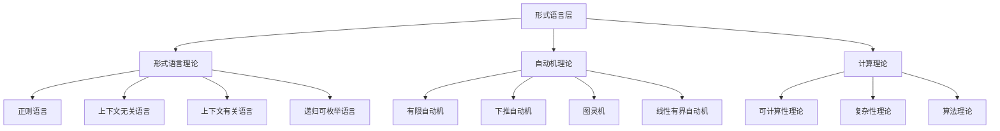
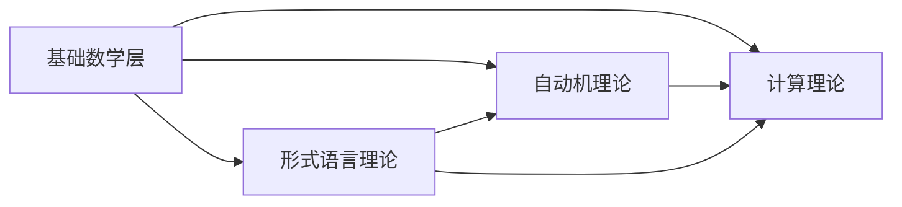

# 形式语言层理论分类图

## 一、概述

形式语言层是理论体系的第二层，建立在基础数学层之上，为上层理论提供语言和计算基础。本层包含形式语言理论、自动机理论和计算理论三个核心分支，每个分支都有其独特的理论体系和应用领域。

## 二、理论层次结构

## 三、详细理论分类

### 3.1 形式语言理论 (Formal Language Theory)

#### 3.1.1 正则语言 (Regular Languages)

**核心概念**：

- 正则表达式
- 正则语法
- 有限状态自动机
- 泵引理

**理论基础**：

- 克莱尼定理
- 泵引理
- 正则语言的封闭性
- 最小化算法

**应用领域**：

- 词法分析
- 模式匹配
- 文本搜索
- 网络协议

**数学定义**：
正则语言是能被有限状态自动机识别的语言集合，满足：
$$L \in \mathcal{REG} \Leftrightarrow \exists A \in \text{FA}: L(A) = L$$

#### 3.1.2 上下文无关语言 (Context-Free Languages)

**核心概念**：

- 上下文无关语法
- 下推自动机
- 语法树
- 乔姆斯基范式

**理论基础**：

- 乔姆斯基层次
- 语法分析算法
- 上下文无关语言的封闭性
- 歧义性分析

**应用领域**：

- 语法分析
- 编译器设计
- 自然语言处理
- 配置文件解析

**数学定义**：
上下文无关语言是能被下推自动机识别的语言集合，满足：
$$L \in \mathcal{CFL} \Leftrightarrow \exists G \in \text{CFG}: L(G) = L$$

#### 3.1.3 上下文有关语言 (Context-Sensitive Languages)

**核心概念**：

- 上下文有关语法
- 线性有界自动机
- 非收缩语法
- 单调语法

**理论基础**：

- 上下文有关语法理论
- 线性有界自动机理论
- 上下文有关语言的封闭性
- 语法分析复杂性

**应用领域**：

- 自然语言处理
- 生物信息学
- 形式化方法
- 知识表示

**数学定义**：
上下文有关语言是能被线性有界自动机识别的语言集合，满足：
$$L \in \mathcal{CSL} \Leftrightarrow \exists A \in \text{LBA}: L(A) = L$$

#### 3.1.4 递归可枚举语言 (Recursively Enumerable Languages)

**核心概念**：

- 递归可枚举语法
- 图灵机
- 半判定性
- 递归语言

**理论基础**：

- 图灵机理论
- 递归函数理论
- 递归可枚举语言的封闭性
- 不可判定性

**应用领域**：

- 计算理论
- 人工智能
- 形式化方法
- 理论计算机科学

**数学定义**：
递归可枚举语言是能被图灵机识别的语言集合，满足：
$$L \in \mathcal{RE} \Leftrightarrow \exists M \in \text{TM}: L(M) = L$$

### 3.2 自动机理论 (Automata Theory)

#### 3.2.1 有限自动机 (Finite Automata)

**核心概念**：

- 状态和转换
- 确定性自动机
- 非确定性自动机
- 最小化

**理论基础**：

- 自动机等价性
- 最小化算法
- 自动机乘积
- 自动机补集

**应用领域**：

- 词法分析
- 模式识别
- 硬件设计
- 协议验证

**数学定义**：
有限自动机是一个五元组 $A = (Q, \Sigma, \delta, q_0, F)$，其中：

- $Q$ 是有限状态集
- $\Sigma$ 是输入字母表
- $\delta: Q \times \Sigma \to Q$ 是转移函数
- $q_0 \in Q$ 是初始状态
- $F \subseteq Q$ 是接受状态集

#### 3.2.2 下推自动机 (Pushdown Automata)

**核心概念**：

- 栈操作
- 状态和栈符号
- 转移规则
- 接受条件

**理论基础**：

- 下推自动机等价性
- 确定性下推自动机
- 下推自动机最小化
- 栈操作复杂性

**应用领域**：

- 语法分析
- 编译器设计
- 自然语言处理
- 形式化验证

**数学定义**：
下推自动机是一个七元组 $P = (Q, \Sigma, \Gamma, \delta, q_0, Z_0, F)$，其中：

- $Q$ 是有限状态集
- $\Sigma$ 是输入字母表
- $\Gamma$ 是栈字母表
- $\delta: Q \times \Sigma \times \Gamma \to \mathcal{P}(Q \times \Gamma^*)$ 是转移函数
- $q_0 \in Q$ 是初始状态
- $Z_0 \in \Gamma$ 是初始栈符号
- $F \subseteq Q$ 是接受状态集

#### 3.2.3 图灵机 (Turing Machine)

**核心概念**：

- 磁带和读写头
- 状态和转换
- 停机问题
- 通用图灵机

**理论基础**：

- 图灵机等价性
- 停机问题不可判定性
- 通用图灵机存在性
- 图灵机复杂性

**应用领域**：

- 计算理论
- 复杂性理论
- 人工智能
- 形式化方法

**数学定义**：
图灵机是一个七元组 $M = (Q, \Sigma, \Gamma, \delta, q_0, B, F)$，其中：

- $Q$ 是有限状态集
- $\Sigma$ 是输入字母表
- $\Gamma$ 是磁带字母表
- $\delta: Q \times \Gamma \to Q \times \Gamma \times \{L, R\}$ 是转移函数
- $q_0 \in Q$ 是初始状态
- $B \in \Gamma$ 是空白符号
- $F \subseteq Q$ 是接受状态集

#### 3.2.4 线性有界自动机 (Linear Bounded Automata)

**核心概念**：

- 线性有界
- 磁带限制
- 上下文有关语言
- 复杂性分析

**理论基础**：

- 线性有界自动机理论
- 上下文有关语言识别
- 线性有界自动机复杂性
- 线性有界自动机等价性

**应用领域**：

- 自然语言处理
- 生物信息学
- 形式化方法
- 复杂性理论

**数学定义**：
线性有界自动机是一个图灵机，其磁带长度被输入长度的线性函数限制，满足：
$$\text{tape length} \leq c \cdot |w| + d$$
其中 $c, d$ 是常数，$w$ 是输入字符串。

### 3.3 计算理论 (Computation Theory)

#### 3.3.1 可计算性理论 (Computability Theory)

**核心概念**：

- 可计算函数
- 递归函数
- 部分递归函数
- 不可计算性

**理论基础**：

- 丘奇-图灵论题
- 递归函数理论
- 不可判定性理论
- 归约理论

**应用领域**：

- 计算理论
- 人工智能
- 形式化方法
- 理论计算机科学

**数学定义**：
函数 $f: \mathbb{N}^k \to \mathbb{N}$ 是可计算的，当且仅当存在图灵机 $M$ 使得：
$$\forall x \in \mathbb{N}^k: f(x) = \text{output of } M \text{ on input } x$$

#### 3.3.2 复杂性理论 (Complexity Theory)

**核心概念**：

- 时间复杂度
- 空间复杂度
- 复杂性类
- 归约

**理论基础**：

- 时间复杂性理论
- 空间复杂性理论
- 复杂性类理论
- 归约理论

**应用领域**：

- 算法设计
- 密码学
- 人工智能
- 系统设计

**数学定义**：
语言 $L$ 属于复杂性类 $\mathcal{C}$，当且仅当存在图灵机 $M$ 和函数 $f$ 使得：
$$L \in \mathcal{C} \Leftrightarrow \exists M: \text{Time}_M(n) \leq f(n) \text{ for all } n$$

#### 3.3.3 算法理论 (Algorithm Theory)

**核心概念**：

- 算法设计
- 算法分析
- 算法优化
- 算法正确性

**理论基础**：

- 算法设计方法
- 算法分析方法
- 算法优化技术
- 算法正确性证明

**应用领域**：

- 软件工程
- 系统设计
- 人工智能
- 科学研究

**数学定义**：
算法是一个有限的计算过程，满足：

1. **有限性**：算法在有限步后终止
2. **确定性**：每个步骤都有明确的定义
3. **输入**：算法有零个或多个输入
4. **输出**：算法有一个或多个输出
5. **有效性**：每个操作都是基本可执行的

## 四、理论依赖关系

### 4.1 基础依赖关系

### 4.2 交叉依赖关系

- **形式语言理论** ↔ **自动机理论**：语言理论为自动机提供识别目标，自动机为语言理论提供识别工具
- **自动机理论** ↔ **计算理论**：自动机为计算理论提供计算模型，计算理论为自动机提供复杂性分析
- **形式语言理论** ↔ **计算理论**：语言理论为计算理论提供研究对象，计算理论为语言理论提供复杂性分析

## 五、理论应用领域

### 5.1 计算机科学应用

- **形式语言理论**：编译器设计、自然语言处理
- **自动机理论**：硬件设计、协议验证
- **计算理论**：算法设计、系统优化

### 5.2 人工智能应用

- **形式语言理论**：知识表示、自然语言理解
- **自动机理论**：模式识别、学习算法
- **计算理论**：机器学习、智能系统

### 5.3 软件工程应用

- **形式语言理论**：语法分析、代码生成
- **自动机理论**：状态机设计、协议实现
- **计算理论**：性能优化、资源管理

## 六、理论发展脉络

### 6.1 历史发展

1. **早期发展**：形式语言和自动机理论
2. **中期发展**：计算理论和复杂性理论
3. **现代发展**：量子计算和生物计算
4. **前沿发展**：量子自动机和生物自动机

### 6.2 发展趋势

1. **量子化**：量子自动机和量子语言
2. **生物化**：生物自动机和生物语言
3. **智能化**：学习自动机和自适应语言
4. **融合化**：多模态语言和混合自动机

## 七、质量检查标准

### 7.1 理论完整性

- ✅ 每个理论分支都有完整的数学定义
- ✅ 每个理论都有明确的识别能力
- ✅ 每个理论都有完整的理论基础
- ✅ 每个理论都有明确的应用领域

### 7.2 逻辑一致性

- ✅ 理论内部逻辑一致
- ✅ 理论间关系清晰
- ✅ 依赖关系无循环
- ✅ 交叉关系无矛盾

### 7.3 实用性

- ✅ 理论便于理解
- ✅ 理论便于应用
- ✅ 理论便于扩展
- ✅ 理论便于维护

---

**注意**：本分类图为形式语言层的理论体系提供了完整的分类和结构，为上层理论的发展提供了语言和计算基础。
