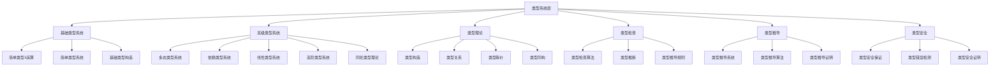

# 类型系统层理论分类图

## 一、层次概述

类型系统层是理论体系的核心层次，位于形式语言层之上，系统理论层之下。它负责为计算系统提供类型安全保障，确保程序的正确性和可靠性。

## 二、理论分类结构

## 三、各子分支详细描述

### 3.1 基础类型系统

#### 3.1.1 简单类型λ演算 (Simply Typed Lambda Calculus)

- **定义**: 为λ演算添加类型注解的形式系统
- **核心概念**: 类型注解、类型规则、类型推导
- **性质**: 强规范化、类型安全、可判定性
- **应用领域**: 函数式编程语言、类型系统基础

#### 3.1.2 简单类型系统 (Simple Type Systems)

- **定义**: 基于基本类型构造的类型系统
- **核心概念**: 基本类型、函数类型、积类型、和类型
- **性质**: 类型安全、类型检查可判定
- **应用领域**: 基础编程语言、类型系统教学

#### 3.1.3 基础类型构造 (Basic Type Constructions)

- **定义**: 构建复杂类型的基本操作
- **核心概念**: 函数类型、积类型、和类型、递归类型
- **性质**: 组合性、可扩展性
- **应用领域**: 类型系统设计、语言实现

### 3.2 高级类型系统

#### 3.2.1 多态类型系统 (Polymorphic Type Systems)

- **定义**: 支持类型参数化的类型系统
- **核心概念**: 类型变量、类型抽象、类型应用
- **性质**: 参数多态、类型安全、代码复用
- **应用领域**: 泛型编程、函数式编程

#### 3.2.2 依赖类型系统 (Dependent Type Systems)

- **定义**: 类型可以依赖于值的类型系统
- **核心概念**: 依赖类型、类型族、证明即程序
- **性质**: 表达能力极强、可证明正确性
- **应用领域**: 定理证明、形式验证、高可靠性编程

#### 3.2.3 线性类型系统 (Linear Type Systems)

- **定义**: 控制资源使用次数的类型系统
- **核心概念**: 线性类型、仿射类型、资源管理
- **性质**: 资源安全、内存安全、并发安全
- **应用领域**: 系统编程、并发编程、资源管理

#### 3.2.4 高阶类型系统 (Higher-Order Type Systems)

- **定义**: 支持高阶类型构造的类型系统
- **核心概念**: 高阶类型、类型构造函数、类型类
- **性质**: 抽象能力强、类型安全
- **应用领域**: 高级函数式编程、类型系统研究

#### 3.2.5 同伦类型理论 (Homotopy Type Theory)

- **定义**: 基于同伦论的现代类型理论
- **核心概念**: 类型作为空间、路径、等价性
- **性质**: 统一数学基础、构造性数学
- **应用领域**: 数学基础、定理证明、形式化数学

### 3.3 类型理论

#### 3.3.1 类型构造 (Type Construction)

- **定义**: 从基本类型构造复杂类型的规则
- **核心概念**: 类型构造子、类型规则、类型推导
- **性质**: 组合性、一致性、完备性
- **应用领域**: 类型系统设计、语言规范

#### 3.3.2 类型关系 (Type Relations)

- **定义**: 类型之间的各种关系
- **核心概念**: 子类型、类型包含、类型兼容
- **性质**: 传递性、自反性、反对称性
- **应用领域**: 类型检查、类型推导

#### 3.3.3 类型等价 (Type Equivalence)

- **定义**: 类型在语义上等价的关系
- **核心概念**: 类型同构、类型等价、类型转换
- **性质**: 等价性、对称性、传递性
- **应用领域**: 类型优化、代码生成

#### 3.3.4 类型同构 (Type Isomorphism)

- **定义**: 类型之间存在双向转换的关系
- **核心概念**: 类型同构、类型转换、类型映射
- **性质**: 双向性、保持性、一致性
- **应用领域**: 类型系统优化、程序变换

### 3.4 类型检查

#### 3.4.1 类型检查算法 (Type Checking Algorithms)

- **定义**: 验证程序类型正确性的算法
- **核心概念**: 类型检查、类型推导、类型错误
- **性质**: 正确性、完备性、效率
- **应用领域**: 编译器、解释器、开发工具

#### 3.4.2 类型推断 (Type Inference)

- **定义**: 自动推导表达式类型的算法
- **核心概念**: 类型推断、类型约束、类型求解
- **性质**: 自动性、正确性、效率
- **应用领域**: 现代编程语言、类型系统

#### 3.4.3 类型推导规则 (Type Derivation Rules)

- **定义**: 从前提推导类型结论的规则
- **核心概念**: 类型规则、类型推导、类型证明
- **性质**: 逻辑性、一致性、完备性
- **应用领域**: 类型系统设计、类型安全证明

### 3.5 类型推导

#### 3.5.1 类型推导系统 (Type Derivation Systems)

- **定义**: 形式化的类型推导框架
- **核心概念**: 类型推导、类型规则、类型证明
- **性质**: 形式化、一致性、完备性
- **应用领域**: 类型理论研究、类型系统设计

#### 3.5.2 类型推导算法 (Type Derivation Algorithms)

- **定义**: 实现类型推导的计算算法
- **核心概念**: 算法实现、类型求解、约束处理
- **性质**: 正确性、效率、可终止性
- **应用领域**: 类型检查器、编译器

#### 3.5.3 类型推导证明 (Type Derivation Proofs)

- **定义**: 证明类型推导正确性的方法
- **核心概念**: 类型证明、类型安全、类型正确性
- **性质**: 形式化、可验证性、完备性
- **应用领域**: 类型系统验证、形式化方法

### 3.6 类型安全

#### 3.6.1 类型安全保证 (Type Safety Guarantees)

- **定义**: 类型系统提供的安全保障
- **核心概念**: 类型安全、运行时安全、内存安全
- **性质**: 安全性、可靠性、可预测性
- **应用领域**: 高可靠性系统、安全关键应用

#### 3.6.2 类型错误检测 (Type Error Detection)

- **定义**: 在编译时检测类型错误
- **核心概念**: 类型错误、错误诊断、错误报告
- **性质**: 早期检测、精确诊断、用户友好
- **应用领域**: 开发工具、错误处理

#### 3.6.3 类型安全证明 (Type Safety Proofs)

- **定义**: 证明类型系统安全性的方法
- **核心概念**: 类型安全、形式化证明、定理证明
- **性质**: 形式化、可验证性、数学严谨性
- **应用领域**: 类型系统研究、形式化方法

## 四、理论联系

### 4.1 与基础数学层的联系

- **集合论**: 类型作为集合，类型关系作为集合关系
- **逻辑**: 类型推导作为逻辑推理，类型规则作为逻辑规则
- **代数**: 类型构造作为代数结构，类型运算作为代数运算

### 4.2 与形式语言层的联系

- **形式语法**: 类型系统作为形式语法系统
- **形式语义**: 类型语义作为形式语义的一部分
- **语言理论**: 类型语言作为形式语言的特例

### 4.3 与系统理论层的联系

- **自动机理论**: 类型检查作为自动机运行
- **Petri网理论**: 类型推导作为Petri网可达性
- **形式方法**: 类型系统作为形式验证的基础

## 五、应用领域

### 5.1 编程语言

- 类型安全编程
- 函数式编程
- 面向对象编程
- 泛型编程

### 5.2 软件工程

- 代码质量保证
- 错误预防
- 重构支持
- 接口设计

### 5.3 形式化方法

- 程序验证
- 定理证明
- 模型检查
- 形式化规范

### 5.4 人工智能

- 知识表示
- 逻辑推理
- 类型学习
- 程序合成

## 六、发展趋势

### 6.1 理论发展

- 同伦类型理论的深化
- 依赖类型的扩展
- 线性类型的应用
- 类型系统的统一

### 6.2 技术发展

- 类型推断的改进
- 类型检查的效率提升
- 类型系统的模块化
- 类型安全的自动化

### 6.3 应用发展

- 大规模系统的类型安全
- 并发系统的类型安全
- 分布式系统的类型安全
- 实时系统的类型安全
