# 系统理论层理论分类图

## 一、层次概述

系统理论层是理论体系的高级层次，位于类型系统层之上，应用实践层之下。它负责为复杂系统提供建模、分析和控制的理论基础，包括自动机理论、Petri网理论、分布式系统理论等核心理论。

## 二、理论分类结构

```mermaid
graph TD
    A[系统理论层] --> B[自动机理论]
    A --> C[Petri网理论]
    A --> D[分布式系统理论]
    A --> E[控制理论]
    A --> F[系统建模理论]
    A --> G[系统分析理论]
    
    B --> B1[有限状态自动机]
    B --> B2[下推自动机]
    B --> B3[图灵机]
    B --> B4[量子自动机]
    B --> B5[概率自动机]
    
    C --> C1[基础Petri网]
    C --> C2[高级Petri网]
    C --> C3[层次Petri网]
    C --> C4[对象Petri网]
    C --> C5[工作流Petri网]
    
    D --> D1[分布式算法]
    D --> D2[一致性理论]
    D --> D3[容错理论]
    D --> D4[分布式协议]
    D --> D5[分布式计算模型]
    
    E --> E1[线性控制理论]
    E --> E2[非线性控制理论]
    E --> E3[自适应控制理论]
    E --> E4[鲁棒控制理论]
    E --> E5[智能控制理论]
    
    F --> F1[形式化建模]
    F --> F2[系统架构建模]
    F --> F3[行为建模]
    F --> F4[结构建模]
    
    G --> G1[性能分析]
    G --> G2[可靠性分析]
    G --> G3[安全性分析]
    G --> G4[可扩展性分析]
```

## 三、各子分支详细描述

### 3.1 自动机理论

#### 3.1.1 有限状态自动机 (Finite State Automata)

- **定义**: 具有有限状态集合的计算模型
- **核心概念**: 状态、转移、输入字母表、接受状态
- **性质**: 确定性/非确定性、正则语言识别、计算能力有限
- **应用领域**: 编译器、模式匹配、硬件设计

#### 3.1.2 下推自动机 (Pushdown Automata)

- **定义**: 具有栈存储的有限状态自动机
- **核心概念**: 状态、栈、转移规则、栈操作
- **性质**: 上下文无关语言识别、非确定性、计算能力增强
- **应用领域**: 语法分析、自然语言处理、编译器设计

#### 3.1.3 图灵机 (Turing Machine)

- **定义**: 具有无限带和读写头的计算模型
- **核心概念**: 状态、带、读写头、转移函数
- **性质**: 通用计算能力、可计算性、停机问题
- **应用领域**: 计算理论、算法分析、复杂性理论

#### 3.1.4 量子自动机 (Quantum Automata)

- **定义**: 基于量子力学原理的自动机模型
- **核心概念**: 量子态、量子叠加、量子测量、量子纠缠
- **性质**: 量子并行性、量子干涉、量子不可克隆性
- **应用领域**: 量子计算、量子信息处理、量子密码学

#### 3.1.5 概率自动机 (Probabilistic Automata)

- **定义**: 转移具有概率分布的自动机
- **核心概念**: 概率转移、期望行为、概率接受
- **性质**: 随机性、概率分布、统计性质
- **应用领域**: 随机算法、机器学习、系统建模

### 3.2 Petri网理论

#### 3.2.1 基础Petri网 (Basic Petri Nets)

- **定义**: 由库所、变迁和弧组成的有向二分图
- **核心概念**: 库所、变迁、标记、激发规则
- **性质**: 并发性、冲突性、可达性、有界性
- **应用领域**: 并发系统建模、工作流分析、性能评估

#### 3.2.2 高级Petri网 (Advanced Petri Nets)

- **定义**: 扩展了基础Petri网功能的网模型
- **核心概念**: 时间、颜色、层次、约束
- **性质**: 时间建模、数据建模、层次建模、约束建模
- **应用领域**: 实时系统、数据流系统、复杂系统建模

#### 3.2.3 层次Petri网 (Hierarchical Petri Nets)

- **定义**: 支持层次化结构的Petri网
- **核心概念**: 子网、抽象、细化、层次关系
- **性质**: 模块化、可重用性、可理解性、可维护性
- **应用领域**: 大型系统建模、软件工程、系统设计

#### 3.2.4 对象Petri网 (Object Petri Nets)

- **定义**: 结合面向对象概念的Petri网
- **核心概念**: 对象、类、继承、封装
- **性质**: 面向对象特性、可重用性、可扩展性
- **应用领域**: 软件系统建模、面向对象设计、系统架构

#### 3.2.5 工作流Petri网 (Workflow Petri Nets)

- **定义**: 专门用于工作流建模的Petri网
- **核心概念**: 任务、角色、资源、流程
- **性质**: 工作流特性、资源管理、流程控制
- **应用领域**: 业务流程建模、工作流管理、企业应用

### 3.3 分布式系统理论

#### 3.3.1 分布式算法 (Distributed Algorithms)

- **定义**: 在分布式环境中执行的算法
- **核心概念**: 分布式计算、消息传递、共识、选举
- **性质**: 分布式特性、容错性、可扩展性
- **应用领域**: 分布式系统、云计算、区块链

#### 3.3.2 一致性理论 (Consistency Theory)

- **定义**: 保证分布式系统数据一致性的理论
- **核心概念**: 强一致性、弱一致性、最终一致性、因果一致性
- **性质**: 一致性保证、性能权衡、可用性
- **应用领域**: 分布式数据库、分布式存储、微服务架构

#### 3.3.3 容错理论 (Fault Tolerance Theory)

- **定义**: 系统在故障情况下保持正确性的理论
- **核心概念**: 故障模型、容错机制、恢复策略、冗余
- **性质**: 可靠性、可用性、可恢复性
- **应用领域**: 高可用系统、关键系统、容错计算

#### 3.3.4 分布式协议 (Distributed Protocols)

- **定义**: 分布式系统中节点间通信的规则
- **核心概念**: 协议设计、协议验证、协议实现
- **性质**: 正确性、效率、可扩展性
- **应用领域**: 网络协议、分布式算法、系统通信

#### 3.3.5 分布式计算模型 (Distributed Computing Models)

- **定义**: 描述分布式计算行为的抽象模型
- **核心概念**: 计算模型、通信模型、同步模型
- **性质**: 抽象性、通用性、可分析性
- **应用领域**: 分布式系统设计、算法分析、系统验证

### 3.4 控制理论

#### 3.4.1 线性控制理论 (Linear Control Theory)

- **定义**: 基于线性系统理论的控制方法
- **核心概念**: 线性系统、状态空间、传递函数、稳定性
- **性质**: 线性特性、叠加原理、频率响应
- **应用领域**: 工业控制、航空航天、机器人控制

#### 3.4.2 非线性控制理论 (Nonlinear Control Theory)

- **定义**: 处理非线性系统控制的理论
- **核心概念**: 非线性系统、李雅普诺夫稳定性、反馈线性化
- **性质**: 非线性特性、复杂性、鲁棒性
- **应用领域**: 复杂系统控制、生物系统、经济系统

#### 3.4.3 自适应控制理论 (Adaptive Control Theory)

- **定义**: 能够适应系统参数变化的控制方法
- **核心概念**: 参数估计、自适应律、收敛性
- **性质**: 自适应性、鲁棒性、学习能力
- **应用领域**: 参数未知系统、时变系统、智能控制

#### 3.4.4 鲁棒控制理论 (Robust Control Theory)

- **定义**: 对系统不确定性具有鲁棒性的控制方法
- **核心概念**: 不确定性建模、鲁棒稳定性、性能保证
- **性质**: 鲁棒性、保守性、性能保证
- **应用领域**: 不确定系统、高可靠性系统、安全关键系统

#### 3.4.5 智能控制理论 (Intelligent Control Theory)

- **定义**: 结合人工智能技术的控制方法
- **核心概念**: 模糊控制、神经网络控制、专家系统控制
- **性质**: 智能性、学习能力、适应性
- **应用领域**: 智能机器人、智能交通、智能家居

### 3.5 系统建模理论

#### 3.5.1 形式化建模 (Formal Modeling)

- **定义**: 使用数学形式化方法描述系统
- **核心概念**: 形式化语言、形式化语义、形式化验证
- **性质**: 精确性、可验证性、数学严谨性
- **应用领域**: 软件工程、硬件设计、系统验证

#### 3.5.2 系统架构建模 (System Architecture Modeling)

- **定义**: 描述系统整体结构和组织方式
- **核心概念**: 架构模式、组件关系、接口设计
- **性质**: 系统性、整体性、层次性
- **应用领域**: 软件架构、系统设计、企业架构

#### 3.5.3 行为建模 (Behavioral Modeling)

- **定义**: 描述系统的动态行为和交互
- **核心概念**: 状态机、时序图、活动图
- **性质**: 动态性、交互性、时序性
- **应用领域**: 系统分析、需求分析、交互设计

#### 3.5.4 结构建模 (Structural Modeling)

- **定义**: 描述系统的静态结构和组成
- **核心概念**: 类图、组件图、部署图
- **性质**: 静态性、结构性、关系性
- **应用领域**: 系统设计、数据库设计、网络设计

### 3.6 系统分析理论

#### 3.6.1 性能分析 (Performance Analysis)

- **定义**: 分析系统的性能特性和指标
- **核心概念**: 性能指标、性能模型、性能优化
- **性质**: 定量性、可测量性、可优化性
- **应用领域**: 系统优化、容量规划、性能调优

#### 3.6.2 可靠性分析 (Reliability Analysis)

- **定义**: 分析系统的可靠性和故障特性
- **核心概念**: 故障率、平均故障时间、可靠性函数
- **性质**: 统计性、预测性、可改进性
- **应用领域**: 系统设计、维护规划、风险评估

#### 3.6.3 安全性分析 (Security Analysis)

- **定义**: 分析系统的安全特性和威胁
- **核心概念**: 威胁模型、安全策略、安全机制
- **性质**: 安全性、完整性、机密性
- **应用领域**: 安全系统设计、风险评估、安全审计

#### 3.6.4 可扩展性分析 (Scalability Analysis)

- **定义**: 分析系统的扩展能力和限制
- **核心概念**: 扩展性指标、瓶颈分析、扩展策略
- **性质**: 可扩展性、可预测性、可规划性
- **应用领域**: 系统设计、容量规划、架构优化

## 四、理论联系

### 4.1 与类型系统层的联系

- **类型检查**: 自动机理论用于类型检查算法
- **类型推导**: Petri网理论用于类型推导过程
- **类型安全**: 控制理论用于类型安全保证

### 4.2 与形式语言层的联系

- **语言识别**: 自动机理论用于形式语言识别
- **语法分析**: 下推自动机用于上下文无关语法分析
- **语义分析**: 形式语义与系统行为建模结合

### 4.3 与基础数学层的联系

- **集合论**: 状态空间作为集合，转移关系作为集合关系
- **逻辑**: 系统行为作为逻辑推理，系统性质作为逻辑公式
- **代数**: 系统结构作为代数结构，系统运算作为代数运算

## 五、应用领域

### 5.1 计算机科学

- 编译器设计
- 操作系统
- 数据库系统
- 网络协议

### 5.2 软件工程

- 系统建模
- 软件架构
- 设计模式
- 测试验证

### 5.3 控制工程

- 工业控制
- 机器人控制
- 航空航天
- 自动化系统

### 5.4 人工智能

- 智能系统
- 机器学习
- 知识表示
- 推理系统

## 六、发展趋势

### 6.1 理论发展

- 量子自动机的深化
- 高级Petri网的扩展
- 分布式理论的统一
- 智能控制的融合

### 6.2 技术发展

- 形式化方法的自动化
- 系统建模的可视化
- 性能分析的智能化
- 安全分析的自动化

### 6.3 应用发展

- 大规模分布式系统
- 智能物联网系统
- 自主控制系统
- 高可靠性系统
