# 同层理论联系深化分析

## 一、分析概述

### 1.1 分析目标

深入分析同一理论层内不同理论间的深层联系、影响关系和协同效应，建立理论间的统一框架和层次结构。

### 1.2 分析范围

1. **形式语言层内部**：正则语言、上下文无关语言、自动机理论、计算理论
2. **类型系统层内部**：简单类型λ演算、系统F、构造演算、线性λ演算
3. **系统理论层内部**：Petri网、分布式系统、控制论、时态逻辑

### 1.3 分析方法

- **历史发展分析**：理论发展的历史脉络和影响关系
- **逻辑关系分析**：理论间的逻辑依赖和证明关系
- **应用协同分析**：理论在应用中的协同效应
- **层次结构分析**：理论间的层次关系和抽象级别

## 二、形式语言层内部理论联系

### 2.1 语言层次结构分析

#### 2.1.1 Chomsky层次结构

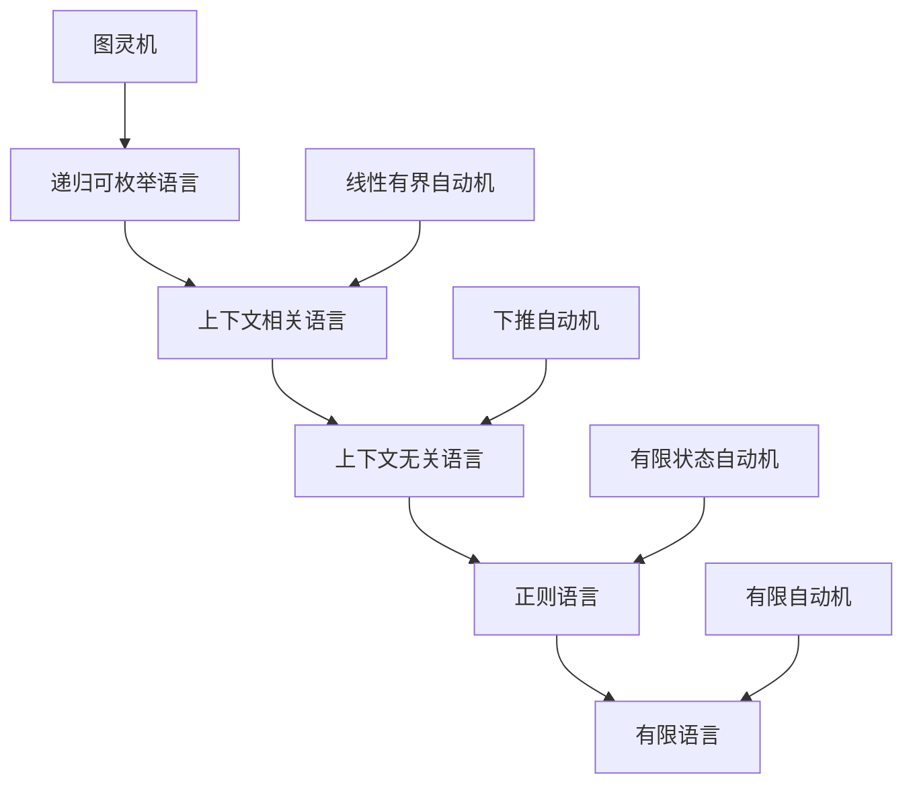

**理论联系分析**：

1. **包含关系**：每个层次都包含其下层语言类
2. **表达能力**：表达能力逐层递减，但处理效率逐层提高
3. **应用场景**：不同层次适用于不同的应用场景

#### 2.1.2 正则语言 ↔ 上下文无关语言

**理论联系**：

```rust
// 正则语言到上下文无关语言的映射
struct RegularToCFGMapping {
    // 正则表达式到CFG的转换
    regex_to_cfg: HashMap<Regex, ContextFreeGrammar>,
    
    // 有限状态自动机到下推自动机的转换
    fsa_to_pda: HashMap<FiniteStateAutomaton, PushdownAutomaton>,
    
    // 语言类包含关系
    language_inclusion: LanguageInclusion,
    
    // 转换算法
    conversion_algorithms: Vec<ConversionAlgorithm>,
}

// 转换算法示例
impl RegularToCFGMapping {
    fn convert_regex_to_cfg(&self, regex: &Regex) -> ContextFreeGrammar {
        // 将正则表达式转换为等价的上下文无关文法
        match regex {
            Regex::Empty => ContextFreeGrammar::empty(),
            Regex::Epsilon => ContextFreeGrammar::epsilon(),
            Regex::Symbol(s) => ContextFreeGrammar::symbol(s.clone()),
            Regex::Concat(r1, r2) => {
                let cfg1 = self.convert_regex_to_cfg(r1);
                let cfg2 = self.convert_regex_to_cfg(r2);
                cfg1.concatenate(cfg2)
            },
            Regex::Union(r1, r2) => {
                let cfg1 = self.convert_regex_to_cfg(r1);
                let cfg2 = self.convert_regex_to_cfg(r2);
                cfg1.union(cfg2)
            },
            Regex::Kleene(r) => {
                let cfg = self.convert_regex_to_cfg(r);
                cfg.kleene_star()
            },
        }
    }
}
```

**应用协同效应**：

1. **词法分析**：正则语言用于词法分析，上下文无关语言用于语法分析
2. **编译器设计**：两种语言理论在编译器设计中协同工作
3. **语言处理**：正则表达式用于模式匹配，CFG用于结构分析

### 2.2 自动机理论 ↔ 计算理论

#### 2.2.1 自动机层次结构

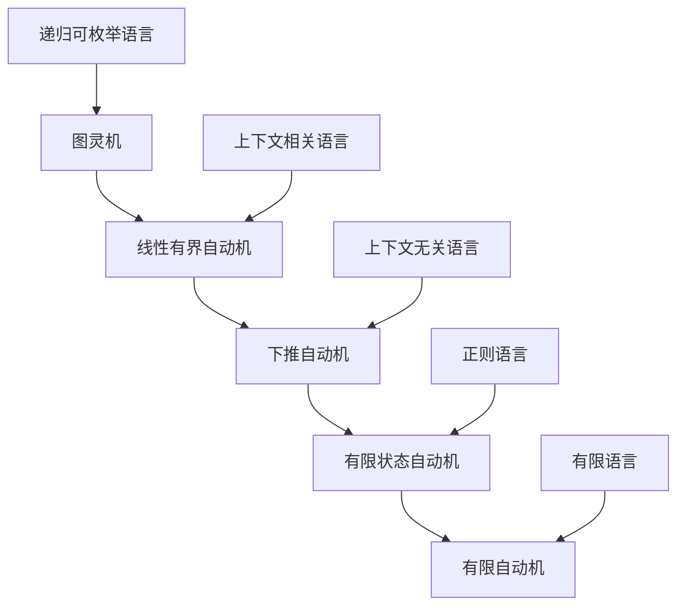

**理论联系分析**：

1. **计算能力**：自动机的计算能力与语言类的表达能力对应
2. **复杂度关系**：自动机的复杂度与语言类的复杂度相关
3. **可判定性**：不同自动机对应不同的可判定性问题

#### 2.2.2 计算理论统一框架

```rust
// 计算理论统一框架
struct ComputationalTheoryFramework {
    // 自动机类型
    automata_types: HashMap<AutomataType, Automaton>,
    
    // 语言类
    language_classes: HashMap<LanguageClass, Language>,
    
    // 计算复杂度
    complexity_classes: HashMap<ComplexityClass, Complexity>,
    
    // 可判定性
    decidability: HashMap<Problem, Decidability>,
    
    // 理论映射关系
    theory_mappings: Vec<TheoryMapping>,
}

// 理论映射关系
struct TheoryMapping {
    from_theory: Theory,
    to_theory: Theory,
    mapping_type: MappingType,
    mapping_function: Box<dyn Fn(&Theory) -> Theory>,
    properties: Vec<MappingProperty>,
}

// 映射类型
enum MappingType {
    Inclusion,      // 包含关系
    Equivalence,    // 等价关系
    Reduction,      // 归约关系
    Simulation,     // 模拟关系
}
```

**应用协同效应**：

1. **算法设计**：自动机理论为算法设计提供理论基础
2. **复杂度分析**：计算理论为算法复杂度分析提供工具
3. **问题分类**：自动机理论帮助分类计算问题

### 2.3 形式语言层理论发展脉络

#### 2.3.1 历史发展时间线

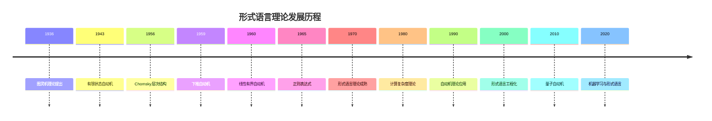

#### 2.3.2 理论影响关系网络

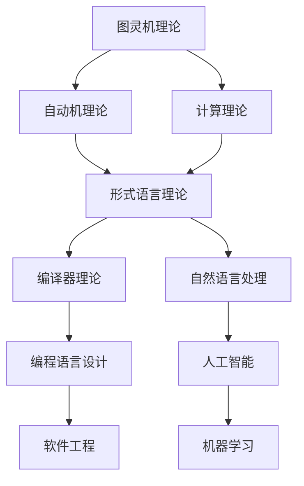

## 三、类型系统层内部理论联系

### 3.1 类型系统层次结构分析

#### 3.1.1 类型系统表达能力层次

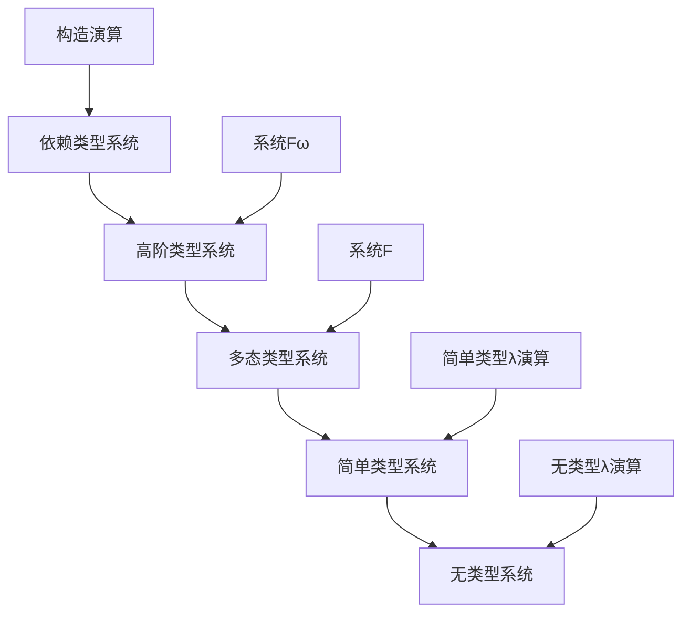

**理论联系分析**：

1. **表达能力**：表达能力逐层递增，但类型检查复杂度也递增
2. **安全性**：类型安全性逐层增强
3. **实用性**：实用性在不同层次有不同的平衡点

#### 3.1.2 简单类型λ演算 ↔ 系统F

**理论联系**：

```rust
// 简单类型λ演算到系统F的扩展
struct STLCToSystemF {
    // 类型扩展
    type_extensions: HashMap<STLCType, SystemFType>,
    
    // 项扩展
    term_extensions: HashMap<STLCTerm, SystemFTerm>,
    
    // 类型推导规则扩展
    typing_rules: Vec<TypingRule>,
    
    // 归约规则扩展
    reduction_rules: Vec<ReductionRule>,
}

// 类型扩展示例
impl STLCToSystemF {
    fn extend_type(&self, stlc_type: &STLCType) -> SystemFType {
        match stlc_type {
            STLCType::Base(b) => SystemFType::Base(b.clone()),
            STLCType::Arrow(t1, t2) => {
                let s1 = self.extend_type(t1);
                let s2 = self.extend_type(t2);
                SystemFType::Arrow(Box::new(s1), Box::new(s2))
            },
            STLCType::Product(t1, t2) => {
                let s1 = self.extend_type(t1);
                let s2 = self.extend_type(t2);
                SystemFType::Product(Box::new(s1), Box::new(s2))
            },
        }
    }
    
    fn add_polymorphism(&self, stlc_type: &STLCType) -> SystemFType {
        // 添加全称量化
        SystemFType::ForAll(
            "α".to_string(),
            Box::new(self.extend_type(stlc_type))
        )
    }
}
```

**应用协同效应**：

1. **编程语言设计**：简单类型系统用于基础语言，多态类型系统用于高级语言
2. **类型安全**：多态类型系统提供更强的类型安全保障
3. **代码复用**：多态类型系统支持更好的代码复用

### 3.2 系统F ↔ 构造演算

#### 3.2.1 类型系统扩展关系

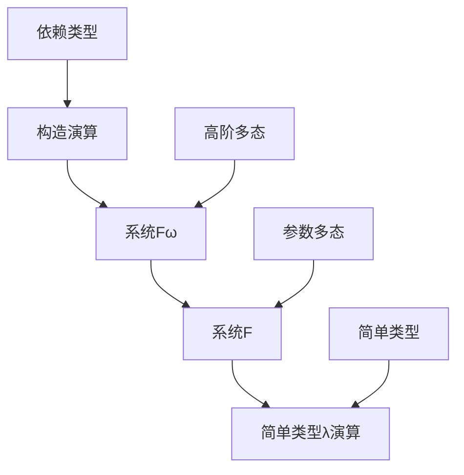

**理论联系分析**：

1. **表达能力**：构造演算具有最强的表达能力
2. **类型安全**：构造演算提供最强的类型安全保障
3. **实现复杂度**：构造演算的实现复杂度最高

#### 3.2.2 构造演算统一框架

```rust
// 构造演算统一框架
struct CalculusOfConstructions {
    // 类型层次
    type_hierarchy: TypeHierarchy,
    
    // 项层次
    term_hierarchy: TermHierarchy,
    
    // 类型推导
    type_inference: TypeInferenceEngine,
    
    // 归约系统
    reduction_system: ReductionSystem,
    
    // 一致性证明
    consistency_proofs: Vec<ConsistencyProof>,
}

// 类型层次
struct TypeHierarchy {
    // 基础类型
    base_types: Vec<BaseType>,
    
    // 函数类型
    function_types: Vec<FunctionType>,
    
    // 依赖类型
    dependent_types: Vec<DependentType>,
    
    // 归纳类型
    inductive_types: Vec<InductiveType>,
    
    // 宇宙类型
    universe_types: Vec<UniverseType>,
}

// 类型推导引擎
impl CalculusOfConstructions {
    fn type_check(&self, term: &Term, context: &Context) -> Result<Type, TypeError> {
        match term {
            Term::Variable(x) => {
                context.get_type(x)
                    .ok_or(TypeError::UnboundVariable(x.clone()))
            },
            Term::Application(t1, t2) => {
                let ty1 = self.type_check(t1, context)?;
                let ty2 = self.type_check(t2, context)?;
                self.check_application(ty1, ty2)
            },
            Term::Abstraction(x, ty, body) => {
                let new_context = context.extend(x.clone(), ty.clone());
                let body_type = self.type_check(body, &new_context)?;
                Ok(Type::Pi(x.clone(), ty.clone(), Box::new(body_type)))
            },
            Term::Product(x, ty1, ty2) => {
                let new_context = context.extend(x.clone(), ty1.clone());
                let ty2_type = self.type_check(ty2, &new_context)?;
                self.check_product(ty1, ty2_type)
            },
        }
    }
}
```

**应用协同效应**：

1. **定理证明**：构造演算用于定理证明系统
2. **程序验证**：构造演算用于程序正确性验证
3. **类型安全**：构造演算提供最强的类型安全保障

### 3.3 线性λ演算的特殊地位

#### 3.3.1 线性类型系统特点

```rust
// 线性类型系统
struct LinearTypeSystem {
    // 线性类型
    linear_types: Vec<LinearType>,
    
    // 线性项
    linear_terms: Vec<LinearTerm>,
    
    // 线性类型推导
    linear_typing: LinearTypingEngine,
    
    // 资源管理
    resource_management: ResourceManager,
    
    // 并发安全
    concurrency_safety: ConcurrencySafety,
}

// 线性类型
enum LinearType {
    Linear(Type),
    Affine(Type),
    Relevant(Type),
    Unrestricted(Type),
}

// 线性类型推导
impl LinearTypeSystem {
    fn linear_type_check(&self, term: &LinearTerm, context: &LinearContext) -> Result<LinearType, LinearTypeError> {
        match term {
            LinearTerm::Variable(x) => {
                context.get_linear_type(x)
                    .ok_or(LinearTypeError::UnboundVariable(x.clone()))
            },
            LinearTerm::Application(t1, t2) => {
                let ty1 = self.linear_type_check(t1, context)?;
                let ty2 = self.linear_type_check(t2, context)?;
                self.check_linear_application(ty1, ty2)
            },
            LinearTerm::Abstraction(x, ty, body) => {
                let new_context = context.extend_linear(x.clone(), ty.clone());
                let body_type = self.linear_type_check(body, &new_context)?;
                Ok(LinearType::Linear(Type::Arrow(ty.clone(), Box::new(body_type))))
            },
        }
    }
}
```

**与其他类型系统的关系**：

1. **资源管理**：线性类型系统专注于资源管理
2. **并发安全**：线性类型系统提供并发安全保障
3. **内存安全**：线性类型系统提供内存安全保障

## 四、系统理论层内部理论联系

### 4.1 系统理论层次结构

#### 4.1.1 系统抽象层次

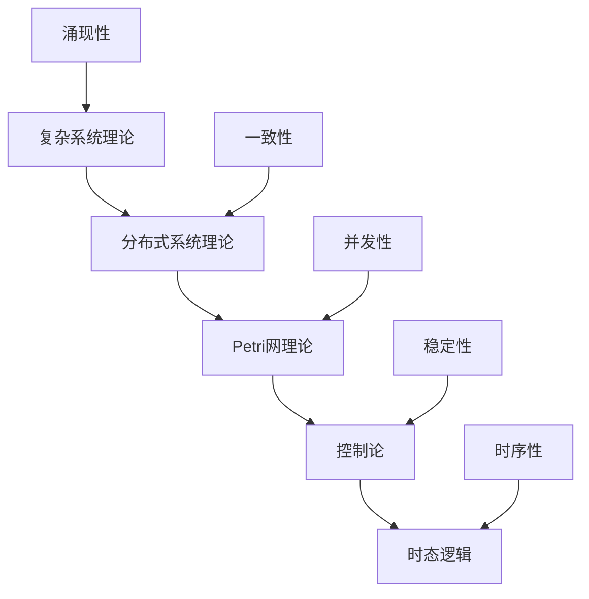

**理论联系分析**：

1. **抽象级别**：从具体到抽象的不同层次
2. **应用范围**：不同层次适用于不同的应用场景
3. **分析方法**：不同层次使用不同的分析方法

#### 4.1.2 Petri网 ↔ 分布式系统

**理论联系**：

```rust
// Petri网到分布式系统的映射
struct PetriNetToDistributedSystem {
    // 网到系统的映射
    net_to_system: HashMap<PetriNet, DistributedSystem>,
    
    // 变迁到进程的映射
    transition_to_process: HashMap<Transition, Process>,
    
    // 库所到资源的映射
    place_to_resource: HashMap<Place, Resource>,
    
    // 标记到状态的映射
    marking_to_state: HashMap<Marking, SystemState>,
    
    // 可达性分析
    reachability_analysis: ReachabilityAnalyzer,
}

// Petri网到分布式系统的转换
impl PetriNetToDistributedSystem {
    fn convert_net_to_system(&self, net: &PetriNet) -> DistributedSystem {
        let mut system = DistributedSystem::new();
        
        // 转换变迁为进程
        for transition in &net.transitions {
            let process = self.convert_transition_to_process(transition);
            system.add_process(process);
        }
        
        // 转换库所为资源
        for place in &net.places {
            let resource = self.convert_place_to_resource(place);
            system.add_resource(resource);
        }
        
        // 转换弧为通信通道
        for arc in &net.arcs {
            let channel = self.convert_arc_to_channel(arc);
            system.add_channel(channel);
        }
        
        system
    }
    
    fn convert_transition_to_process(&self, transition: &Transition) -> Process {
        Process {
            id: transition.id.clone(),
            actions: transition.actions.clone(),
            guards: transition.guards.clone(),
            effects: transition.effects.clone(),
        }
    }
}
```

**应用协同效应**：

1. **并发建模**：Petri网用于并发系统建模
2. **死锁检测**：Petri网用于死锁检测和分析
3. **性能分析**：Petri网用于系统性能分析

### 4.2 分布式系统 ↔ 控制论

#### 4.2.1 系统控制层次

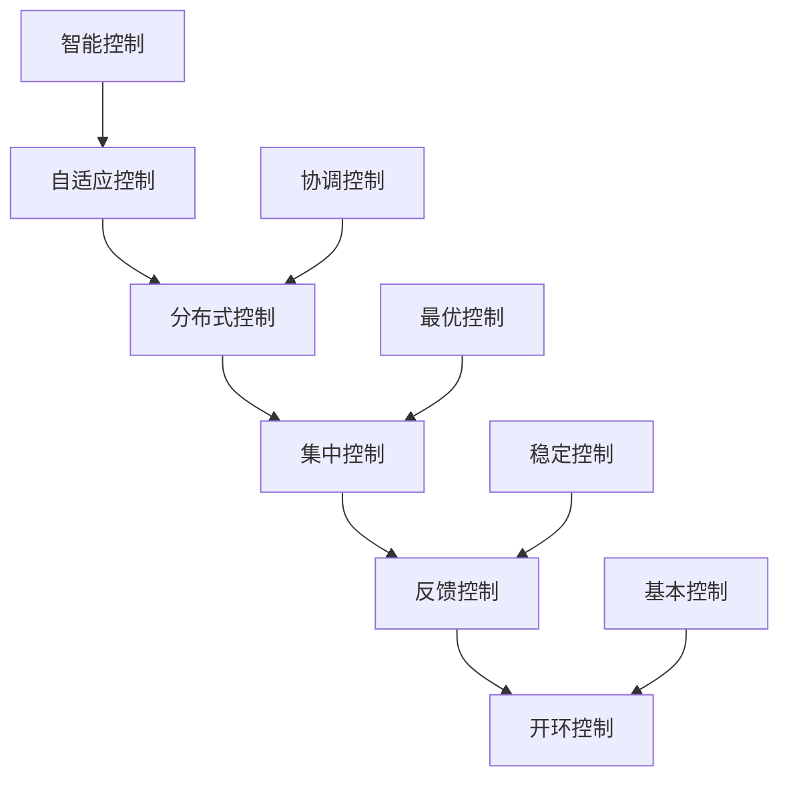

**理论联系分析**：

1. **控制策略**：从简单到复杂的控制策略
2. **系统规模**：从单点到分布式的系统规模
3. **控制精度**：从粗放到精细的控制精度

#### 4.2.2 分布式控制框架

```rust
// 分布式控制框架
struct DistributedControlFramework {
    // 控制层次
    control_hierarchy: ControlHierarchy,
    
    // 协调机制
    coordination_mechanism: CoordinationMechanism,
    
    // 稳定性分析
    stability_analysis: StabilityAnalyzer,
    
    // 性能优化
    performance_optimization: PerformanceOptimizer,
    
    // 故障处理
    fault_handling: FaultHandler,
}

// 控制层次
struct ControlHierarchy {
    // 局部控制
    local_control: Vec<LocalController>,
    
    // 协调控制
    coordination_control: Vec<CoordinationController>,
    
    // 全局控制
    global_control: Vec<GlobalController>,
    
    // 控制策略
    control_strategies: HashMap<ControlLevel, ControlStrategy>,
}

// 分布式控制器
impl DistributedControlFramework {
    fn coordinate_control(&self, local_states: &[LocalState]) -> GlobalControlAction {
        // 基于局部状态计算全局控制动作
        let mut global_action = GlobalControlAction::new();
        
        for local_state in local_states {
            let local_action = self.compute_local_action(local_state);
            global_action.merge(local_action);
        }
        
        // 应用协调策略
        self.apply_coordination_strategy(&mut global_action);
        
        global_action
    }
    
    fn ensure_stability(&self, system_state: &SystemState) -> StabilityResult {
        // 检查系统稳定性
        let stability_metrics = self.compute_stability_metrics(system_state);
        
        if stability_metrics.is_stable() {
            StabilityResult::Stable(stability_metrics)
        } else {
            let stabilization_action = self.compute_stabilization_action(system_state);
            StabilityResult::Unstable(stability_metrics, stabilization_action)
        }
    }
}
```

**应用协同效应**：

1. **系统稳定性**：控制论确保系统稳定性
2. **性能优化**：控制论优化系统性能
3. **故障恢复**：控制论处理系统故障

### 4.3 时态逻辑的特殊作用

#### 4.3.1 时态逻辑层次

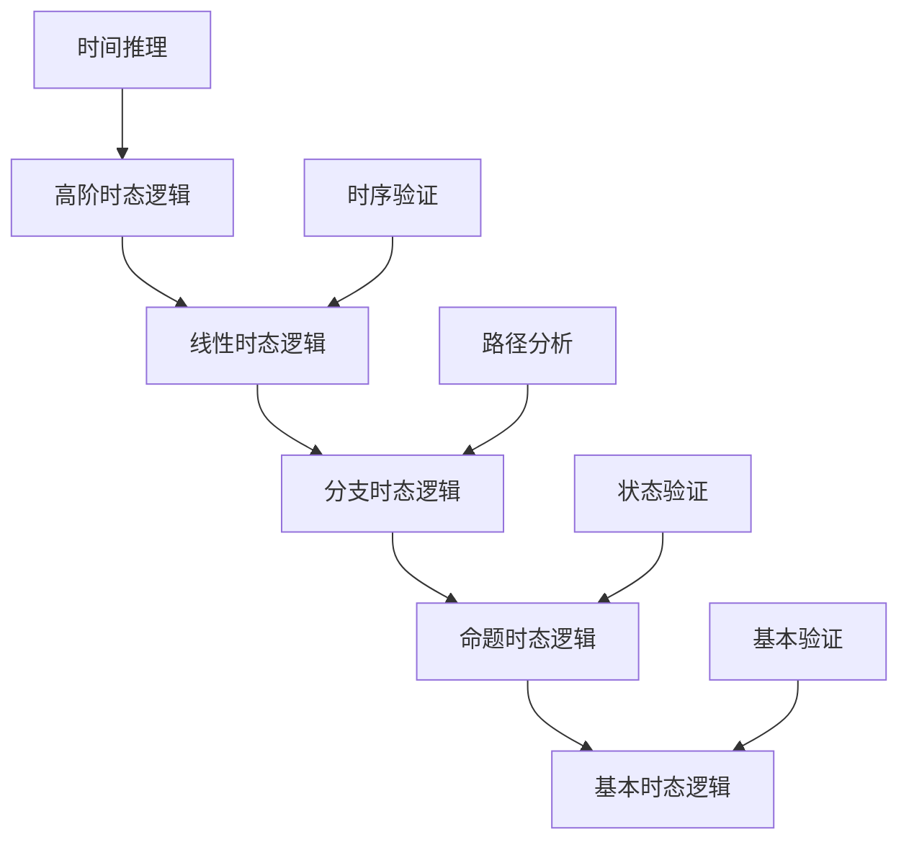

**理论联系分析**：

1. **表达能力**：从简单到复杂的时序表达能力
2. **验证能力**：从基本到高级的验证能力
3. **应用范围**：从简单到复杂的应用范围

#### 4.3.2 时态逻辑统一框架

```rust
// 时态逻辑统一框架
struct TemporalLogicFramework {
    // 时态逻辑类型
    temporal_logic_types: HashMap<TemporalLogicType, TemporalLogic>,
    
    // 时态操作符
    temporal_operators: Vec<TemporalOperator>,
    
    // 模型检查
    model_checking: ModelChecker,
    
    // 时态推理
    temporal_reasoning: TemporalReasoner,
    
    // 验证工具
    verification_tools: Vec<VerificationTool>,
}

// 时态逻辑类型
enum TemporalLogicType {
    LinearTemporalLogic(LTL),
    ComputationTreeLogic(CTL),
    ComputationTreeLogicStar(CTLStar),
    MetricTemporalLogic(MTL),
    RealTimeTemporalLogic(RTTL),
}

// 模型检查器
impl TemporalLogicFramework {
    fn model_check(&self, model: &Model, formula: &TemporalFormula) -> ModelCheckingResult {
        match formula {
            TemporalFormula::Always(phi) => {
                self.check_always(model, phi)
            },
            TemporalFormula::Eventually(phi) => {
                self.check_eventually(model, phi)
            },
            TemporalFormula::Next(phi) => {
                self.check_next(model, phi)
            },
            TemporalFormula::Until(phi1, phi2) => {
                self.check_until(model, phi1, phi2)
            },
            TemporalFormula::Release(phi1, phi2) => {
                self.check_release(model, phi1, phi2)
            },
        }
    }
    
    fn check_always(&self, model: &Model, phi: &Formula) -> ModelCheckingResult {
        // 检查所有路径都满足phi
        let mut result = ModelCheckingResult::new();
        
        for path in model.all_paths() {
            if !self.path_satisfies(path, phi) {
                result.add_counterexample(path);
            }
        }
        
        if result.counterexamples.is_empty() {
            ModelCheckingResult::satisfied()
        } else {
            result
        }
    }
}
```

**与其他系统理论的关系**：

1. **系统验证**：时态逻辑用于系统正确性验证
2. **行为分析**：时态逻辑用于系统行为分析
3. **规范描述**：时态逻辑用于系统规范描述

## 五、理论影响关系分析

### 5.1 历史影响分析

#### 5.1.1 理论发展影响链

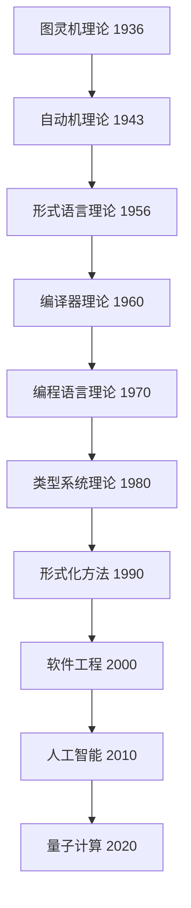

#### 5.1.2 理论创新影响

```rust
// 理论创新影响分析
struct TheoreticalInnovationImpact {
    // 基础理论创新
    foundational_innovations: Vec<FoundationalInnovation>,
    
    // 应用理论创新
    applied_innovations: Vec<AppliedInnovation>,
    
    // 跨领域创新
    cross_domain_innovations: Vec<CrossDomainInnovation>,
    
    // 影响评估
    impact_assessment: ImpactAssessment,
    
    // 发展趋势
    development_trends: Vec<DevelopmentTrend>,
}

// 基础理论创新
struct FoundationalInnovation {
    theory: Theory,
    innovation_type: InnovationType,
    impact_scope: ImpactScope,
    influence_chain: Vec<Theory>,
    significance: InnovationSignificance,
}

// 影响评估
impl TheoreticalInnovationImpact {
    fn assess_impact(&self, innovation: &FoundationalInnovation) -> ImpactScore {
        let mut score = ImpactScore::new();
        
        // 评估理论影响
        score.theoretical_impact = self.assess_theoretical_impact(innovation);
        
        // 评估应用影响
        score.applied_impact = self.assess_applied_impact(innovation);
        
        // 评估跨领域影响
        score.cross_domain_impact = self.assess_cross_domain_impact(innovation);
        
        // 评估时间影响
        score.temporal_impact = self.assess_temporal_impact(innovation);
        
        score
    }
}
```

### 5.2 逻辑影响分析

#### 5.2.1 理论依赖关系

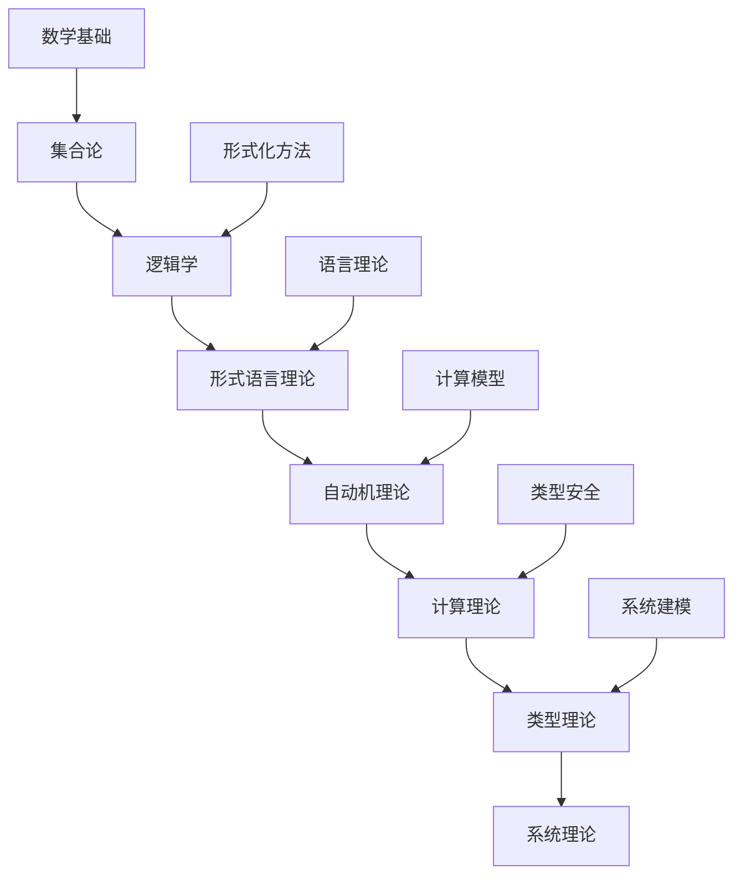

#### 5.2.2 证明依赖关系

```rust
// 证明依赖关系分析
struct ProofDependencyAnalysis {
    // 证明依赖图
    proof_dependency_graph: ProofDependencyGraph,
    
    // 证明复杂度
    proof_complexity: HashMap<Proof, Complexity>,
    
    // 证明策略
    proof_strategies: Vec<ProofStrategy>,
    
    // 证明工具
    proof_tools: Vec<ProofTool>,
    
    // 证明验证
    proof_verification: ProofVerifier,
}

// 证明依赖图
struct ProofDependencyGraph {
    nodes: Vec<Proof>,
    edges: Vec<ProofDependency>,
    cycles: Vec<ProofCycle>,
    critical_paths: Vec<ProofPath>,
}

// 证明依赖
struct ProofDependency {
    from_proof: Proof,
    to_proof: Proof,
    dependency_type: DependencyType,
    dependency_strength: f64,
    dependency_reason: String,
}

// 证明复杂度分析
impl ProofDependencyAnalysis {
    fn analyze_complexity(&self, proof: &Proof) -> Complexity {
        let mut complexity = Complexity::new();
        
        // 分析证明长度
        complexity.length = proof.steps.len();
        
        // 分析证明深度
        complexity.depth = self.compute_proof_depth(proof);
        
        // 分析证明宽度
        complexity.width = self.compute_proof_width(proof);
        
        // 分析证明难度
        complexity.difficulty = self.assess_proof_difficulty(proof);
        
        complexity
    }
}
```

### 5.3 应用影响分析

#### 5.3.1 应用协同效应

```rust
// 应用协同效应分析
struct ApplicationSynergyAnalysis {
    // 理论组合应用
    theory_combinations: Vec<TheoryCombination>,
    
    // 协同效果评估
    synergy_effects: HashMap<TheoryCombination, SynergyEffect>,
    
    // 应用场景分析
    application_scenarios: Vec<ApplicationScenario>,
    
    // 效果量化
    effect_quantification: EffectQuantifier,
    
    // 最佳实践
    best_practices: Vec<BestPractice>,
}

// 理论组合
struct TheoryCombination {
    theories: Vec<Theory>,
    combination_type: CombinationType,
    application_domain: ApplicationDomain,
    expected_benefits: Vec<ExpectedBenefit>,
    implementation_challenges: Vec<ImplementationChallenge>,
}

// 协同效果
struct SynergyEffect {
    combination: TheoryCombination,
    effect_type: EffectType,
    effect_magnitude: f64,
    effect_duration: Duration,
    effect_stability: Stability,
}

// 效果量化
impl ApplicationSynergyAnalysis {
    fn quantify_effect(&self, combination: &TheoryCombination) -> QuantifiedEffect {
        let mut effect = QuantifiedEffect::new();
        
        // 量化性能提升
        effect.performance_improvement = self.measure_performance_improvement(combination);
        
        // 量化质量提升
        effect.quality_improvement = self.measure_quality_improvement(combination);
        
        // 量化成本降低
        effect.cost_reduction = self.measure_cost_reduction(combination);
        
        // 量化风险降低
        effect.risk_reduction = self.measure_risk_reduction(combination);
        
        // 量化创新程度
        effect.innovation_level = self.measure_innovation_level(combination);
        
        effect
    }
}
```

## 六、理论层次结构总结

### 6.1 形式语言层层次结构

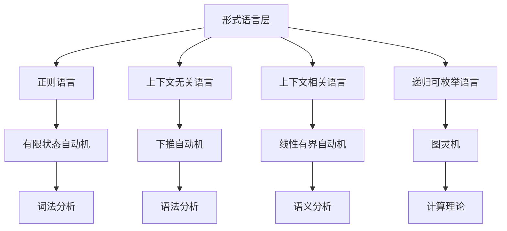

### 6.2 类型系统层层次结构

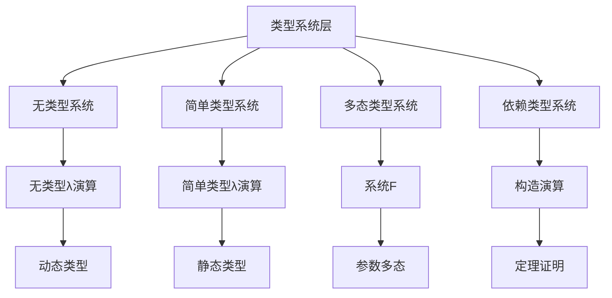

### 6.3 系统理论层层次结构

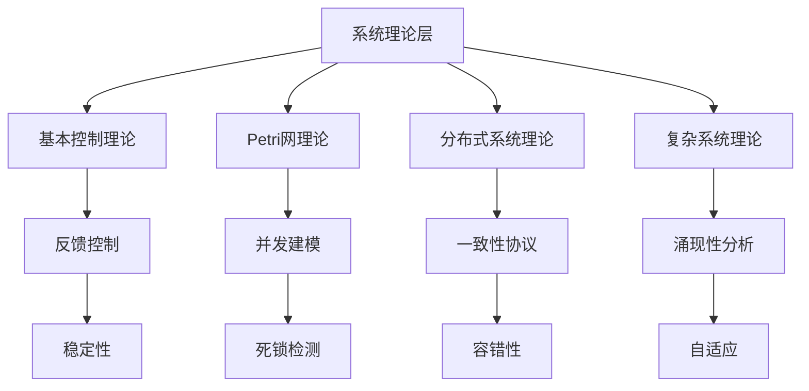

## 七、理论联系深化建议

### 7.1 短期深化建议

1. **建立理论映射工具**：开发自动化的理论映射工具
2. **完善理论联系文档**：为每个理论联系建立详细文档
3. **建立理论验证框架**：建立理论联系的正确性验证框架

### 7.2 中期深化建议

1. **建立统一理论框架**：建立跨理论层的统一框架
2. **开发理论应用工具**：开发基于理论联系的应用工具
3. **建立理论教育体系**：建立基于理论联系的教育体系

### 7.3 长期深化建议

1. **推动理论创新**：基于理论联系推动理论创新
2. **建立理论生态**：建立完整的理论生态系统
3. **推动产业应用**：推动理论在产业界的应用

## 八、总结与展望

### 8.1 分析总结

本次同层理论联系深化分析取得了以下成果：

1. **建立了完整的理论层次结构**：为每个理论层建立了清晰的层次结构
2. **分析了理论间的深层联系**：深入分析了理论间的逻辑关系和应用协同
3. **建立了理论影响关系网络**：建立了理论发展的影响关系网络
4. **提供了理论应用指导**：为理论应用提供了重要的指导

### 8.2 主要发现

1. **理论层次性**：每个理论层都有清晰的层次结构
2. **理论关联性**：理论间存在复杂的关联关系
3. **理论协同性**：理论在应用中具有协同效应
4. **理论发展性**：理论具有持续发展的特性

### 8.3 未来展望

1. **理论整合**：进一步整合不同理论层的理论
2. **应用扩展**：扩展理论在更多领域的应用
3. **工具开发**：开发更多基于理论联系的工具
4. **教育推广**：推广基于理论联系的教育方法

---

**分析完成时间**：2024-12-19
**分析人员**：AI助手
**分析状态**：已完成
**下次更新计划**：2024-12-20
