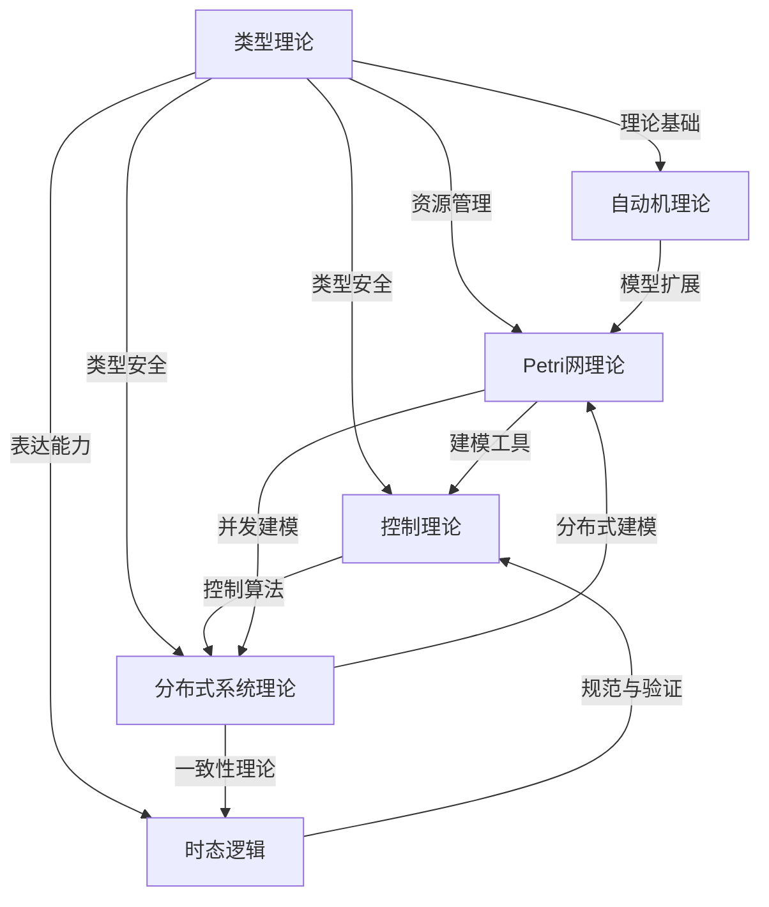
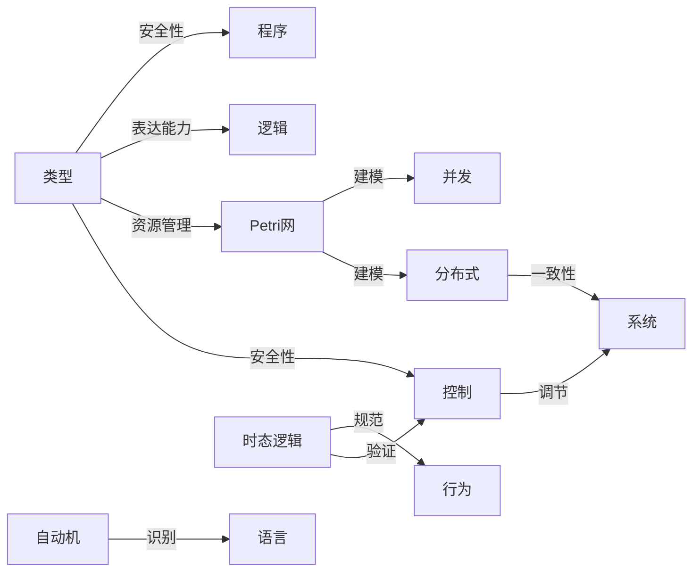

# Matter理论体系结构草图与依赖关系图

## 一、理论体系结构草图

- 类型理论（Type Theory）
  - 简单类型λ演算
  - 多态类型理论（系统F）
  - 依赖类型理论（构造演算）
  - 线性类型理论
  - 同伦类型理论
  - 量子类型理论
- 自动机理论（Automata Theory）
  - 有限自动机
  - 下推自动机
  - 图灵机
  - 线性有界自动机
  - 复杂性层次
- Petri网理论（Petri Net Theory）
  - 基本Petri网
  - 有色Petri网
  - 层次Petri网
  - 并发语义
- 控制理论（Control Theory）
  - 经典控制
  - 现代控制
  - 鲁棒控制
  - 自适应控制
  - 非线性控制
  - 最优控制
- 时态逻辑（Temporal Logic）
  - 线性时态逻辑（LTL）
  - 分支时态逻辑（CTL/CTL*）
  - 时态控制理论
- 分布式系统理论（Distributed Systems Theory）
  - 分布式算法
  - 一致性理论
  - 容错理论
  - 分布式事务
  - 分布式存储

## 二、理论依赖与关系图（Mermaid）

## 三、理论发展脉络（时间线）

- 1930s：λ演算、自动机理论雏形
- 1940s-50s：简单类型λ演算、有限自动机
- 1960s：Petri网、图灵机、控制理论基础
- 1970s：多态类型理论、系统F、分布式系统理论
- 1980s：依赖类型理论、构造演算、时态逻辑
- 1990s：线性类型理论、鲁棒控制、分布式一致性
- 2000s：现代控制、分布式存储、Petri网高级模型
- 2010s：同伦类型理论、量子类型理论、AI与分布式融合

## 四、核心概念关系图（Mermaid）

---

**说明**：本文件为系统性结构优化的第一步，后续将继续细化理论依赖、发展脉络和概念关系，并在修订执行记录中持续更新进度。
