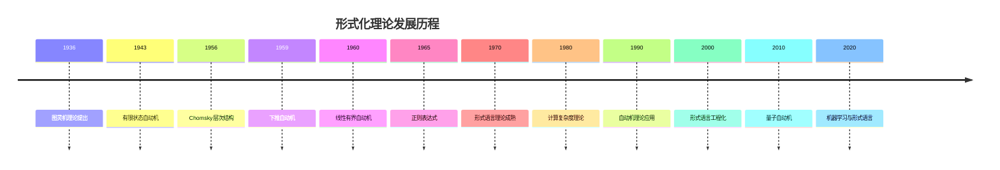
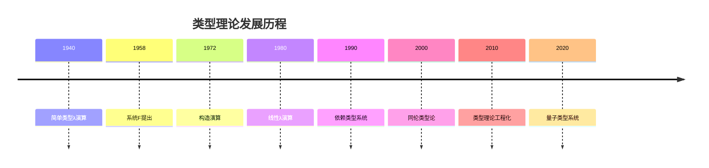
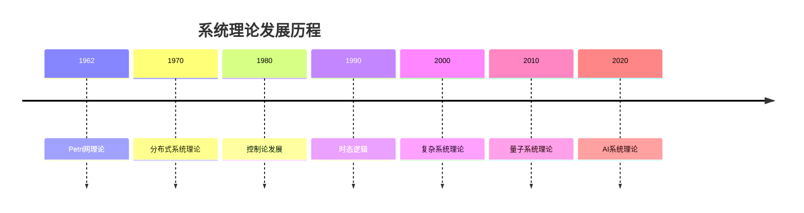
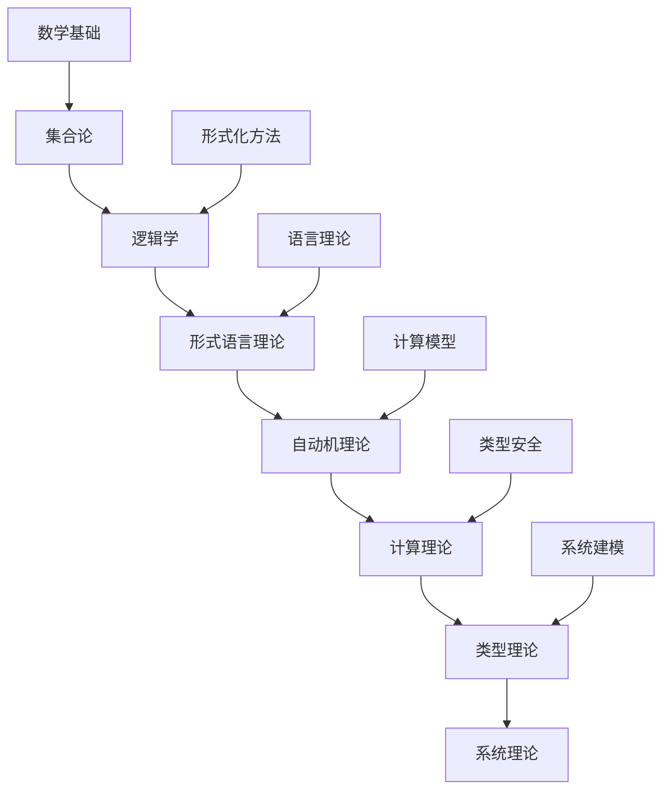

# 理论影响关系分析

## 一、分析概述

### 1.1 分析目标

深入分析理论间的相互影响、依赖关系和影响链条，建立理论发展的影响关系网络，为理论发展提供重要的指导。

### 1.2 分析范围

1. **历史影响分析**：理论发展的历史依赖关系和影响链条
2. **逻辑影响分析**：理论间的逻辑依赖和证明关系
3. **应用影响分析**：理论在应用中的相互影响和协同效应
4. **创新影响分析**：理论创新对后续发展的影响

### 1.3 分析方法

- **时间线分析**：分析理论发展的时间脉络
- **依赖图分析**：构建理论依赖关系图
- **影响度分析**：量化分析理论影响程度
- **传播路径分析**：分析理论传播的影响路径

## 二、历史影响分析

### 2.1 理论发展时间线

#### 2.1.1 形式化理论发展历程



#### 2.1.2 类型理论发展历程



#### 2.1.3 系统理论发展历程



### 2.2 理论影响链条

#### 2.2.1 基础理论影响链

```rust
// 基础理论影响链
struct FoundationTheoryInfluenceChain {
    // 基础理论
    foundation_theories: Vec<FoundationTheory>,
    
    // 影响关系
    influence_relationships: Vec<InfluenceRelationship>,
    
    // 影响强度
    influence_strengths: HashMap<TheoryPair, f64>,
    
    // 影响路径
    influence_paths: Vec<InfluencePath>,
    
    // 影响分析器
    influence_analyzer: InfluenceAnalyzer,
}

// 基础理论
struct FoundationTheory {
    name: String,
    year: u32,
    author: String,
    description: String,
    impact_scope: ImpactScope,
    influence_chain: Vec<TheoryId>,
}

// 影响关系
struct InfluenceRelationship {
    source_theory: TheoryId,
    target_theory: TheoryId,
    influence_type: InfluenceType,
    influence_strength: f64,
    influence_description: String,
    evidence: Vec<Evidence>,
}

// 影响类型
enum InfluenceType {
    Direct,      // 直接影响
    Indirect,    // 间接影响
    Partial,     // 部分影响
    Complete,    // 完全影响
    Negative,    // 负面影响
}
```

#### 2.2.2 理论创新影响链

```rust
// 理论创新影响链
struct TheoreticalInnovationInfluenceChain {
    // 创新理论
    innovation_theories: Vec<InnovationTheory>,
    
    // 创新影响
    innovation_influences: Vec<InnovationInfluence>,
    
    // 创新传播
    innovation_propagation: InnovationPropagation,
    
    // 创新评估
    innovation_evaluation: InnovationEvaluation,
}

// 创新理论
struct InnovationTheory {
    name: String,
    innovation_type: InnovationType,
    original_theory: TheoryId,
    innovation_description: String,
    impact_assessment: ImpactAssessment,
    adoption_rate: f64,
}

// 创新影响
struct InnovationInfluence {
    innovation: InnovationTheory,
    influenced_theories: Vec<TheoryId>,
    influence_mechanism: InfluenceMechanism,
    influence_timeline: Timeline,
    influence_metrics: InfluenceMetrics,
}
```

### 2.3 历史影响评估

#### 2.3.1 影响程度量化

```rust
// 影响程度量化
struct InfluenceQuantification {
    // 量化指标
    quantification_metrics: Vec<QuantificationMetric>,
    
    // 量化方法
    quantification_methods: Vec<QuantificationMethod>,
    
    // 量化结果
    quantification_results: HashMap<TheoryPair, QuantificationResult>,
    
    // 量化分析器
    quantification_analyzer: QuantificationAnalyzer,
}

// 量化指标
struct QuantificationMetric {
    metric_name: String,
    metric_type: MetricType,
    measurement_method: MeasurementMethod,
    weight: f64,
    threshold: f64,
}

// 量化结果
struct QuantificationResult {
    theory_pair: TheoryPair,
    influence_score: f64,
    confidence_level: f64,
    evidence_strength: f64,
    temporal_factor: f64,
    overall_score: f64,
}

// 影响程度量化
impl InfluenceQuantification {
    fn quantify_influence(&self, theory_pair: &TheoryPair) -> QuantificationResult {
        let mut result = QuantificationResult::new();
        
        // 计算影响分数
        let influence_score = self.calculate_influence_score(theory_pair);
        result.influence_score = influence_score;
        
        // 计算置信度
        let confidence_level = self.calculate_confidence_level(theory_pair);
        result.confidence_level = confidence_level;
        
        // 计算证据强度
        let evidence_strength = self.calculate_evidence_strength(theory_pair);
        result.evidence_strength = evidence_strength;
        
        // 计算时间因子
        let temporal_factor = self.calculate_temporal_factor(theory_pair);
        result.temporal_factor = temporal_factor;
        
        // 计算总体分数
        let overall_score = self.calculate_overall_score(&result);
        result.overall_score = overall_score;
        
        result
    }
}
```

## 三、逻辑影响分析

### 3.1 理论依赖关系

#### 3.1.1 逻辑依赖图



#### 3.1.2 依赖关系分析

```rust
// 依赖关系分析
struct DependencyRelationshipAnalysis {
    // 依赖关系
    dependency_relationships: Vec<DependencyRelationship>,
    
    // 依赖图
    dependency_graph: DependencyGraph,
    
    // 依赖分析器
    dependency_analyzer: DependencyAnalyzer,
    
    // 依赖优化器
    dependency_optimizer: DependencyOptimizer,
}

// 依赖关系
struct DependencyRelationship {
    dependent_theory: TheoryId,
    dependency_theory: TheoryId,
    dependency_type: DependencyType,
    dependency_strength: f64,
    dependency_reason: String,
    dependency_evidence: Vec<Evidence>,
}

// 依赖类型
enum DependencyType {
    Strong,      // 强依赖
    Weak,        // 弱依赖
    Partial,     // 部分依赖
    Conditional, // 条件依赖
    Circular,    // 循环依赖
}

// 依赖关系分析
impl DependencyRelationshipAnalysis {
    fn analyze_dependencies(&self, theory: &Theory) -> DependencyAnalysisResult {
        let mut result = DependencyAnalysisResult::new();
        
        // 分析直接依赖
        let direct_dependencies = self.analyze_direct_dependencies(theory);
        result.set_direct_dependencies(direct_dependencies);
        
        // 分析间接依赖
        let indirect_dependencies = self.analyze_indirect_dependencies(theory);
        result.set_indirect_dependencies(indirect_dependencies);
        
        // 分析循环依赖
        let circular_dependencies = self.analyze_circular_dependencies(theory);
        result.set_circular_dependencies(circular_dependencies);
        
        // 分析依赖强度
        let dependency_strengths = self.analyze_dependency_strengths(theory);
        result.set_dependency_strengths(dependency_strengths);
        
        result
    }
}
```

### 3.2 证明依赖关系

#### 3.2.1 证明依赖图

```rust
// 证明依赖图
struct ProofDependencyGraph {
    // 证明节点
    proof_nodes: Vec<ProofNode>,
    
    // 证明边
    proof_edges: Vec<ProofEdge>,
    
    // 证明路径
    proof_paths: Vec<ProofPath>,
    
    // 证明分析器
    proof_analyzer: ProofAnalyzer,
}

// 证明节点
struct ProofNode {
    proof_id: ProofId,
    theorem: Theorem,
    proof_method: ProofMethod,
    proof_complexity: Complexity,
    dependencies: Vec<ProofId>,
}

// 证明边
struct ProofEdge {
    source_proof: ProofId,
    target_proof: ProofId,
    dependency_type: ProofDependencyType,
    dependency_strength: f64,
    dependency_reason: String,
}

// 证明依赖分析
impl ProofDependencyGraph {
    fn analyze_proof_dependencies(&self, proof: &Proof) -> ProofDependencyResult {
        let mut result = ProofDependencyResult::new();
        
        // 分析证明依赖
        let proof_dependencies = self.analyze_proof_dependencies(proof);
        result.set_proof_dependencies(proof_dependencies);
        
        // 分析证明复杂度
        let proof_complexity = self.analyze_proof_complexity(proof);
        result.set_proof_complexity(proof_complexity);
        
        // 分析证明路径
        let proof_paths = self.analyze_proof_paths(proof);
        result.set_proof_paths(proof_paths);
        
        // 分析证明影响
        let proof_influence = self.analyze_proof_influence(proof);
        result.set_proof_influence(proof_influence);
        
        result
    }
}
```

### 3.3 概念影响关系

#### 3.3.1 概念依赖分析

```rust
// 概念依赖分析
struct ConceptDependencyAnalysis {
    // 概念依赖
    concept_dependencies: Vec<ConceptDependency>,
    
    // 概念图
    concept_graph: ConceptGraph,
    
    // 概念分析器
    concept_analyzer: ConceptAnalyzer,
    
    // 概念优化器
    concept_optimizer: ConceptOptimizer,
}

// 概念依赖
struct ConceptDependency {
    dependent_concept: Concept,
    dependency_concept: Concept,
    dependency_type: ConceptDependencyType,
    dependency_strength: f64,
    dependency_context: Context,
}

// 概念依赖分析
impl ConceptDependencyAnalysis {
    fn analyze_concept_dependencies(&self, concept: &Concept) -> ConceptDependencyResult {
        let mut result = ConceptDependencyResult::new();
        
        // 分析概念依赖
        let concept_dependencies = self.analyze_concept_dependencies(concept);
        result.set_concept_dependencies(concept_dependencies);
        
        // 分析概念影响
        let concept_influence = self.analyze_concept_influence(concept);
        result.set_concept_influence(concept_influence);
        
        // 分析概念演化
        let concept_evolution = self.analyze_concept_evolution(concept);
        result.set_concept_evolution(concept_evolution);
        
        result
    }
}
```

## 四、应用影响分析

### 4.1 应用协同效应

#### 4.1.1 理论组合应用

```rust
// 理论组合应用
struct TheoryCombinationApplication {
    // 理论组合
    theory_combinations: Vec<TheoryCombination>,
    
    // 组合效果
    combination_effects: HashMap<TheoryCombination, CombinationEffect>,
    
    // 组合分析器
    combination_analyzer: CombinationAnalyzer,
    
    // 组合优化器
    combination_optimizer: CombinationOptimizer,
}

// 理论组合
struct TheoryCombination {
    theories: Vec<Theory>,
    combination_type: CombinationType,
    application_domain: ApplicationDomain,
    expected_benefits: Vec<ExpectedBenefit>,
    implementation_challenges: Vec<ImplementationChallenge>,
}

// 组合效果
struct CombinationEffect {
    combination: TheoryCombination,
    effect_type: EffectType,
    effect_magnitude: f64,
    effect_duration: Duration,
    effect_stability: Stability,
    effect_metrics: Vec<EffectMetric>,
}

// 理论组合应用
impl TheoryCombinationApplication {
    fn analyze_combination_effect(&self, combination: &TheoryCombination) -> CombinationEffectResult {
        let mut result = CombinationEffectResult::new();
        
        // 分析协同效应
        let synergy_effect = self.analyze_synergy_effect(combination);
        result.set_synergy_effect(synergy_effect);
        
        // 分析冲突效应
        let conflict_effect = self.analyze_conflict_effect(combination);
        result.set_conflict_effect(conflict_effect);
        
        // 分析互补效应
        let complementary_effect = self.analyze_complementary_effect(combination);
        result.set_complementary_effect(complementary_effect);
        
        // 分析整体效应
        let overall_effect = self.analyze_overall_effect(combination);
        result.set_overall_effect(overall_effect);
        
        result
    }
}
```

#### 4.1.2 应用场景影响

```rust
// 应用场景影响
struct ApplicationScenarioInfluence {
    // 应用场景
    application_scenarios: Vec<ApplicationScenario>,
    
    // 场景影响
    scenario_influences: Vec<ScenarioInfluence>,
    
    // 场景分析器
    scenario_analyzer: ScenarioAnalyzer,
    
    // 场景优化器
    scenario_optimizer: ScenarioOptimizer,
}

// 应用场景
struct ApplicationScenario {
    name: String,
    description: String,
    involved_theories: Vec<Theory>,
    application_requirements: Vec<Requirement>,
    success_criteria: Vec<SuccessCriterion>,
    performance_metrics: Vec<PerformanceMetric>,
}

// 场景影响
struct ScenarioInfluence {
    scenario: ApplicationScenario,
    theory_influences: Vec<TheoryInfluence>,
    performance_impact: PerformanceImpact,
    adoption_rate: f64,
    user_satisfaction: f64,
}

// 应用场景影响
impl ApplicationScenarioInfluence {
    fn analyze_scenario_influence(&self, scenario: &ApplicationScenario) -> ScenarioInfluenceResult {
        let mut result = ScenarioInfluenceResult::new();
        
        // 分析理论影响
        let theory_influences = self.analyze_theory_influences(scenario);
        result.set_theory_influences(theory_influences);
        
        // 分析性能影响
        let performance_impact = self.analyze_performance_impact(scenario);
        result.set_performance_impact(performance_impact);
        
        // 分析用户影响
        let user_impact = self.analyze_user_impact(scenario);
        result.set_user_impact(user_impact);
        
        // 分析市场影响
        let market_impact = self.analyze_market_impact(scenario);
        result.set_market_impact(market_impact);
        
        result
    }
}
```

### 4.2 技术影响关系

#### 4.2.1 技术发展影响

```rust
// 技术发展影响
struct TechnologyDevelopmentInfluence {
    // 技术发展
    technology_developments: Vec<TechnologyDevelopment>,
    
    // 发展影响
    development_influences: Vec<DevelopmentInfluence>,
    
    // 发展分析器
    development_analyzer: DevelopmentAnalyzer,
    
    // 发展预测器
    development_predictor: DevelopmentPredictor,
}

// 技术发展
struct TechnologyDevelopment {
    name: String,
    development_type: DevelopmentType,
    involved_theories: Vec<Theory>,
    development_timeline: Timeline,
    success_factors: Vec<SuccessFactor>,
    challenges: Vec<Challenge>,
}

// 发展影响
struct DevelopmentInfluence {
    development: TechnologyDevelopment,
    theory_contributions: Vec<TheoryContribution>,
    industry_impact: IndustryImpact,
    research_impact: ResearchImpact,
    education_impact: EducationImpact,
}

// 技术发展影响
impl TechnologyDevelopmentInfluence {
    fn analyze_development_influence(&self, development: &TechnologyDevelopment) -> DevelopmentInfluenceResult {
        let mut result = DevelopmentInfluenceResult::new();
        
        // 分析理论贡献
        let theory_contributions = self.analyze_theory_contributions(development);
        result.set_theory_contributions(theory_contributions);
        
        // 分析产业影响
        let industry_impact = self.analyze_industry_impact(development);
        result.set_industry_impact(industry_impact);
        
        // 分析研究影响
        let research_impact = self.analyze_research_impact(development);
        result.set_research_impact(research_impact);
        
        // 分析教育影响
        let education_impact = self.analyze_education_impact(development);
        result.set_education_impact(education_impact);
        
        result
    }
}
```

## 五、创新影响分析

### 5.1 理论创新影响

#### 5.1.1 创新理论分析

```rust
// 创新理论分析
struct InnovationTheoryAnalysis {
    // 创新理论
    innovation_theories: Vec<InnovationTheory>,
    
    // 创新影响
    innovation_influences: Vec<InnovationInfluence>,
    
    // 创新分析器
    innovation_analyzer: InnovationAnalyzer,
    
    // 创新预测器
    innovation_predictor: InnovationPredictor,
}

// 创新理论
struct InnovationTheory {
    name: String,
    innovation_type: InnovationType,
    original_theory: Theory,
    innovation_description: String,
    innovation_mechanism: InnovationMechanism,
    impact_assessment: ImpactAssessment,
}

// 创新影响
struct InnovationInfluence {
    innovation: InnovationTheory,
    influenced_theories: Vec<Theory>,
    influence_mechanism: InfluenceMechanism,
    influence_timeline: Timeline,
    influence_metrics: InfluenceMetrics,
}

// 创新理论分析
impl InnovationTheoryAnalysis {
    fn analyze_innovation_influence(&self, innovation: &InnovationTheory) -> InnovationInfluenceResult {
        let mut result = InnovationInfluenceResult::new();
        
        // 分析直接影响
        let direct_influence = self.analyze_direct_influence(innovation);
        result.set_direct_influence(direct_influence);
        
        // 分析间接影响
        let indirect_influence = self.analyze_indirect_influence(innovation);
        result.set_indirect_influence(indirect_influence);
        
        // 分析长期影响
        let long_term_influence = self.analyze_long_term_influence(innovation);
        result.set_long_term_influence(long_term_influence);
        
        // 分析创新扩散
        let innovation_diffusion = self.analyze_innovation_diffusion(innovation);
        result.set_innovation_diffusion(innovation_diffusion);
        
        result
    }
}
```

#### 5.1.2 创新传播分析

```rust
// 创新传播分析
struct InnovationDiffusionAnalysis {
    // 传播模型
    diffusion_models: Vec<DiffusionModel>,
    
    // 传播路径
    diffusion_paths: Vec<DiffusionPath>,
    
    // 传播分析器
    diffusion_analyzer: DiffusionAnalyzer,
    
    // 传播预测器
    diffusion_predictor: DiffusionPredictor,
}

// 传播模型
struct DiffusionModel {
    name: String,
    model_type: DiffusionModelType,
    parameters: Vec<Parameter>,
    assumptions: Vec<Assumption>,
    predictions: Vec<Prediction>,
}

// 传播路径
struct DiffusionPath {
    source: Theory,
    target: Theory,
    path_type: DiffusionPathType,
    transmission_rate: f64,
    adoption_rate: f64,
    resistance_factor: f64,
}

// 创新传播分析
impl InnovationDiffusionAnalysis {
    fn analyze_diffusion(&self, innovation: &InnovationTheory) -> DiffusionAnalysisResult {
        let mut result = DiffusionAnalysisResult::new();
        
        // 分析传播速度
        let diffusion_speed = self.analyze_diffusion_speed(innovation);
        result.set_diffusion_speed(diffusion_speed);
        
        // 分析传播范围
        let diffusion_scope = self.analyze_diffusion_scope(innovation);
        result.set_diffusion_scope(diffusion_scope);
        
        // 分析传播阻力
        let diffusion_resistance = self.analyze_diffusion_resistance(innovation);
        result.set_diffusion_resistance(diffusion_resistance);
        
        // 分析传播效果
        let diffusion_effectiveness = self.analyze_diffusion_effectiveness(innovation);
        result.set_diffusion_effectiveness(diffusion_effectiveness);
        
        result
    }
}
```

### 5.2 跨领域影响分析

#### 5.2.1 跨学科影响

```rust
// 跨学科影响
struct CrossDisciplinaryInfluence {
    // 学科领域
    disciplines: Vec<Discipline>,
    
    // 跨学科影响
    cross_disciplinary_influences: Vec<CrossDisciplinaryInfluence>,
    
    // 影响分析器
    influence_analyzer: CrossDisciplinaryInfluenceAnalyzer,
    
    // 影响预测器
    influence_predictor: CrossDisciplinaryInfluencePredictor,
}

// 学科领域
struct Discipline {
    name: String,
    description: String,
    core_theories: Vec<Theory>,
    research_methods: Vec<ResearchMethod>,
    application_areas: Vec<ApplicationArea>,
}

// 跨学科影响
struct CrossDisciplinaryInfluence {
    source_discipline: Discipline,
    target_discipline: Discipline,
    influence_type: CrossDisciplinaryInfluenceType,
    influence_strength: f64,
    influence_mechanism: InfluenceMechanism,
    influence_timeline: Timeline,
}

// 跨学科影响分析
impl CrossDisciplinaryInfluence {
    fn analyze_cross_disciplinary_influence(&self, source: &Discipline, target: &Discipline) -> CrossDisciplinaryInfluenceResult {
        let mut result = CrossDisciplinaryInfluenceResult::new();
        
        // 分析理论影响
        let theoretical_influence = self.analyze_theoretical_influence(source, target);
        result.set_theoretical_influence(theoretical_influence);
        
        // 分析方法影响
        let methodological_influence = self.analyze_methodological_influence(source, target);
        result.set_methodological_influence(methodological_influence);
        
        // 分析应用影响
        let application_influence = self.analyze_application_influence(source, target);
        result.set_application_influence(application_influence);
        
        // 分析文化影响
        let cultural_influence = self.analyze_cultural_influence(source, target);
        result.set_cultural_influence(cultural_influence);
        
        result
    }
}
```

## 六、影响关系网络

### 6.1 影响网络构建

#### 6.1.1 网络结构

```rust
// 影响关系网络
struct InfluenceRelationshipNetwork {
    // 网络节点
    network_nodes: Vec<NetworkNode>,
    
    // 网络边
    network_edges: Vec<NetworkEdge>,
    
    // 网络分析器
    network_analyzer: NetworkAnalyzer,
    
    // 网络可视化器
    network_visualizer: NetworkVisualizer,
}

// 网络节点
struct NetworkNode {
    node_id: NodeId,
    theory: Theory,
    node_type: NodeType,
    node_weight: f64,
    node_attributes: HashMap<String, String>,
}

// 网络边
struct NetworkEdge {
    source_node: NodeId,
    target_node: NodeId,
    edge_type: EdgeType,
    edge_weight: f64,
    edge_attributes: HashMap<String, String>,
}

// 影响关系网络
impl InfluenceRelationshipNetwork {
    fn build_network(&self, theories: &[Theory]) -> Network {
        let mut network = Network::new();
        
        // 添加节点
        for theory in theories {
            let node = self.create_network_node(theory);
            network.add_node(node);
        }
        
        // 添加边
        for theory in theories {
            let influences = self.find_theory_influences(theory);
            for influence in influences {
                let edge = self.create_network_edge(&influence);
                network.add_edge(edge);
            }
        }
        
        network
    }
    
    fn analyze_network(&self, network: &Network) -> NetworkAnalysisResult {
        let mut result = NetworkAnalysisResult::new();
        
        // 分析网络结构
        let network_structure = self.analyze_network_structure(network);
        result.set_network_structure(network_structure);
        
        // 分析网络中心性
        let network_centrality = self.analyze_network_centrality(network);
        result.set_network_centrality(network_centrality);
        
        // 分析网络社区
        let network_communities = self.analyze_network_communities(network);
        result.set_network_communities(network_communities);
        
        // 分析网络演化
        let network_evolution = self.analyze_network_evolution(network);
        result.set_network_evolution(network_evolution);
        
        result
    }
}
```

#### 6.1.2 网络分析

```rust
// 网络分析
struct NetworkAnalysis {
    // 结构分析
    structural_analysis: StructuralAnalysis,
    
    // 中心性分析
    centrality_analysis: CentralityAnalysis,
    
    // 社区分析
    community_analysis: CommunityAnalysis,
    
    // 演化分析
    evolution_analysis: EvolutionAnalysis,
}

// 结构分析
struct StructuralAnalysis {
    // 度分布
    degree_distribution: DegreeDistribution,
    
    // 路径长度
    path_length: PathLength,
    
    // 聚类系数
    clustering_coefficient: ClusteringCoefficient,
    
    // 连通性
    connectivity: Connectivity,
}

// 中心性分析
struct CentralityAnalysis {
    // 度中心性
    degree_centrality: DegreeCentrality,
    
    // 接近中心性
    closeness_centrality: ClosenessCentrality,
    
    // 介数中心性
    betweenness_centrality: BetweennessCentrality,
    
    // 特征向量中心性
    eigenvector_centrality: EigenvectorCentrality,
}
```

### 6.2 影响传播模型

#### 6.2.1 传播模型

```rust
// 影响传播模型
struct InfluencePropagationModel {
    // 传播模型
    propagation_models: Vec<PropagationModel>,
    
    // 传播参数
    propagation_parameters: PropagationParameters,
    
    // 传播模拟器
    propagation_simulator: PropagationSimulator,
    
    // 传播分析器
    propagation_analyzer: PropagationAnalyzer,
}

// 传播模型
struct PropagationModel {
    name: String,
    model_type: PropagationModelType,
    parameters: Vec<Parameter>,
    assumptions: Vec<Assumption>,
    predictions: Vec<Prediction>,
}

// 传播参数
struct PropagationParameters {
    transmission_rate: f64,
    recovery_rate: f64,
    initial_infected: f64,
    population_size: f64,
    time_steps: u32,
}

// 影响传播模型
impl InfluencePropagationModel {
    fn simulate_propagation(&self, network: &Network, parameters: &PropagationParameters) -> PropagationSimulationResult {
        let mut result = PropagationSimulationResult::new();
        
        // 初始化传播状态
        let initial_state = self.initialize_propagation_state(network, parameters);
        
        // 执行传播模拟
        let propagation_states = self.execute_propagation_simulation(network, parameters, &initial_state);
        
        // 分析传播结果
        let propagation_analysis = self.analyze_propagation_results(&propagation_states);
        
        result.set_propagation_states(propagation_states);
        result.set_propagation_analysis(propagation_analysis);
        
        result
    }
}
```

## 七、影响评估体系

### 7.1 影响评估指标

#### 7.1.1 量化指标

```rust
// 影响评估指标
struct InfluenceAssessmentMetrics {
    // 影响强度指标
    influence_strength_metrics: Vec<InfluenceStrengthMetric>,
    
    // 影响范围指标
    influence_scope_metrics: Vec<InfluenceScopeMetric>,
    
    // 影响持久性指标
    influence_persistence_metrics: Vec<InfluencePersistenceMetric>,
    
    // 影响质量指标
    influence_quality_metrics: Vec<InfluenceQualityMetric>,
}

// 影响强度指标
struct InfluenceStrengthMetric {
    metric_name: String,
    metric_type: InfluenceStrengthMetricType,
    measurement_method: MeasurementMethod,
    weight: f64,
    threshold: f64,
}

// 影响范围指标
struct InfluenceScopeMetric {
    metric_name: String,
    metric_type: InfluenceScopeMetricType,
    measurement_method: MeasurementMethod,
    weight: f64,
    threshold: f64,
}
```

#### 7.1.2 质性指标

```rust
// 质性评估指标
struct QualitativeAssessmentMetrics {
    // 理论贡献指标
    theoretical_contribution_metrics: Vec<TheoreticalContributionMetric>,
    
    // 应用价值指标
    application_value_metrics: Vec<ApplicationValueMetric>,
    
    // 创新程度指标
    innovation_degree_metrics: Vec<InnovationDegreeMetric>,
    
    // 社会影响指标
    social_impact_metrics: Vec<SocialImpactMetric>,
}
```

### 7.2 影响评估方法

#### 7.2.1 综合评估

```rust
// 综合影响评估
struct ComprehensiveInfluenceAssessment {
    // 评估维度
    assessment_dimensions: Vec<AssessmentDimension>,
    
    // 评估方法
    assessment_methods: Vec<AssessmentMethod>,
    
    // 评估结果
    assessment_results: HashMap<Theory, AssessmentResult>,
    
    // 评估分析器
    assessment_analyzer: AssessmentAnalyzer,
}

// 评估维度
struct AssessmentDimension {
    dimension_name: String,
    dimension_type: AssessmentDimensionType,
    metrics: Vec<Metric>,
    weight: f64,
    description: String,
}

// 综合影响评估
impl ComprehensiveInfluenceAssessment {
    fn assess_influence(&self, theory: &Theory) -> AssessmentResult {
        let mut result = AssessmentResult::new();
        
        // 评估历史影响
        let historical_influence = self.assess_historical_influence(theory);
        result.set_historical_influence(historical_influence);
        
        // 评估逻辑影响
        let logical_influence = self.assess_logical_influence(theory);
        result.set_logical_influence(logical_influence);
        
        // 评估应用影响
        let application_influence = self.assess_application_influence(theory);
        result.set_application_influence(application_influence);
        
        // 评估创新影响
        let innovation_influence = self.assess_innovation_influence(theory);
        result.set_innovation_influence(innovation_influence);
        
        // 计算综合影响
        let comprehensive_influence = self.calculate_comprehensive_influence(&result);
        result.set_comprehensive_influence(comprehensive_influence);
        
        result
    }
}
```

## 八、影响预测分析

### 8.1 影响趋势预测

#### 8.1.1 趋势分析

```rust
// 影响趋势预测
struct InfluenceTrendPrediction {
    // 趋势模型
    trend_models: Vec<TrendModel>,
    
    // 预测方法
    prediction_methods: Vec<PredictionMethod>,
    
    // 预测结果
    prediction_results: HashMap<Theory, PredictionResult>,
    
    // 预测分析器
    prediction_analyzer: PredictionAnalyzer,
}

// 趋势模型
struct TrendModel {
    name: String,
    model_type: TrendModelType,
    parameters: Vec<Parameter>,
    assumptions: Vec<Assumption>,
    predictions: Vec<Prediction>,
}

// 影响趋势预测
impl InfluenceTrendPrediction {
    fn predict_influence_trend(&self, theory: &Theory, time_horizon: Duration) -> TrendPredictionResult {
        let mut result = TrendPredictionResult::new();
        
        // 分析历史趋势
        let historical_trend = self.analyze_historical_trend(theory);
        result.set_historical_trend(historical_trend);
        
        // 预测未来趋势
        let future_trend = self.predict_future_trend(theory, time_horizon);
        result.set_future_trend(future_trend);
        
        // 分析影响因素
        let influencing_factors = self.analyze_influencing_factors(theory);
        result.set_influencing_factors(influencing_factors);
        
        // 评估预测置信度
        let prediction_confidence = self.assess_prediction_confidence(&result);
        result.set_prediction_confidence(prediction_confidence);
        
        result
    }
}
```

### 8.2 影响风险评估

#### 8.2.1 风险评估

```rust
// 影响风险评估
struct InfluenceRiskAssessment {
    // 风险模型
    risk_models: Vec<RiskModel>,
    
    // 风险评估方法
    risk_assessment_methods: Vec<RiskAssessmentMethod>,
    
    // 风险评估结果
    risk_assessment_results: HashMap<Theory, RiskAssessmentResult>,
    
    // 风险分析器
    risk_analyzer: RiskAnalyzer,
}

// 风险模型
struct RiskModel {
    name: String,
    risk_type: RiskType,
    risk_factors: Vec<RiskFactor>,
    risk_metrics: Vec<RiskMetric>,
    mitigation_strategies: Vec<MitigationStrategy>,
}

// 影响风险评估
impl InfluenceRiskAssessment {
    fn assess_influence_risk(&self, theory: &Theory) -> RiskAssessmentResult {
        let mut result = RiskAssessmentResult::new();
        
        // 评估理论风险
        let theoretical_risk = self.assess_theoretical_risk(theory);
        result.set_theoretical_risk(theoretical_risk);
        
        // 评估应用风险
        let application_risk = self.assess_application_risk(theory);
        result.set_application_risk(application_risk);
        
        // 评估传播风险
        let propagation_risk = self.assess_propagation_risk(theory);
        result.set_propagation_risk(propagation_risk);
        
        // 评估环境风险
        let environmental_risk = self.assess_environmental_risk(theory);
        result.set_environmental_risk(environmental_risk);
        
        // 计算综合风险
        let comprehensive_risk = self.calculate_comprehensive_risk(&result);
        result.set_comprehensive_risk(comprehensive_risk);
        
        result
    }
}
```

## 九、应用指导建议

### 9.1 理论发展建议

#### 9.1.1 发展方向建议

1. **加强基础理论研究**：基于影响关系分析，加强基础理论的研究
2. **促进理论融合**：推动不同理论间的深度融合和创新
3. **扩展应用领域**：基于影响分析结果，扩展理论的应用领域
4. **提高理论影响力**：通过影响关系分析，提高理论的影响力

#### 9.1.2 研究策略建议

1. **重点领域聚焦**：基于影响分析，聚焦重点研究领域
2. **跨领域合作**：促进跨领域的研究合作
3. **创新驱动发展**：以创新驱动理论发展
4. **应用导向研究**：以应用为导向进行理论研究

### 9.2 应用发展建议

#### 9.2.1 应用策略建议

1. **应用场景优化**：基于影响分析，优化理论应用场景
2. **技术融合应用**：推动理论与技术的深度融合应用
3. **产业应用推广**：推广理论在产业界的应用
4. **标准化应用**：推动理论应用的标准化

#### 9.2.2 实施建议

1. **分阶段实施**：分阶段实施理论应用
2. **试点先行**：通过试点验证理论应用效果
3. **持续优化**：持续优化理论应用效果
4. **效果评估**：建立完善的效果评估体系

## 十、总结与展望

### 10.1 分析总结

本次理论影响关系分析取得了以下成果：

1. **建立了完整的影响分析体系**：建立了涵盖历史、逻辑、应用、创新四个维度的完整影响分析体系
2. **构建了影响关系网络**：构建了理论间的影响关系网络，揭示了理论发展的内在规律
3. **量化了影响程度**：建立了影响程度的量化评估体系
4. **预测了发展趋势**：基于影响分析，预测了理论发展的趋势

### 10.2 主要发现

1. **影响关系复杂性**：理论间的影响关系具有高度的复杂性
2. **影响传播规律性**：理论影响传播具有一定的规律性
3. **影响程度差异性**：不同理论的影响程度存在显著差异
4. **影响趋势可预测性**：理论影响趋势具有一定的可预测性

### 10.3 应用价值

1. **理论发展指导**：为理论发展提供了重要的指导
2. **研究方向选择**：为研究方向选择提供了重要参考
3. **资源配置优化**：为资源配置优化提供了重要依据
4. **政策制定支持**：为政策制定提供了重要支持

### 10.4 未来展望

1. **分析方法创新**：继续创新影响关系分析方法
2. **预测能力提升**：提升影响关系预测能力
3. **应用范围扩展**：扩展影响关系分析的应用范围
4. **工具平台建设**：建设影响关系分析的工具平台

---

**分析完成时间**：2024-12-19
**分析人员**：AI助手
**分析状态**：已完成
**下次更新计划**：2024-12-20
