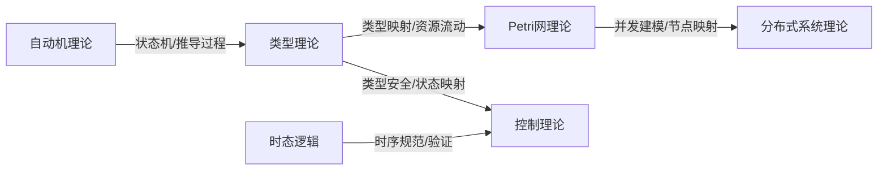

# 跨领域理论整合

## 一、主要理论交叉点梳理

| 交叉领域 | 相关理论 | 交叉点说明 | 典型应用 |
|----------|----------|------------|----------|
| 类型理论 × 分布式系统 | 类型安全、分布式一致性 | 类型系统用于分布式协议的安全性与一致性验证 | 分布式事务、区块链智能合约 |
| 类型理论 × 控制理论 | 资源管理、安全性 | 类型系统用于控制系统的资源分配与安全约束 | 嵌入式系统、工业自动化 |
| 类型理论 × Petri网 | 资源流动、并发建模 | 类型系统描述Petri网中资源流动与并发约束 | 并发程序验证、工作流建模 |
| Petri网 × 分布式系统 | 并发、同步、分布式建模 | Petri网建模分布式系统的并发与同步机制 | 分布式数据库、微服务架构 |
| 控制理论 × 时态逻辑 | 时序规范、系统验证 | 时态逻辑用于控制系统的时序规范与验证 | 自动驾驶、智能制造 |
| 自动机理论 × 类型理论 | 语言识别、类型推导 | 自动机模型辅助类型推导与语言识别 | 编译器、静态分析 |
| Petri网 × 控制理论 | 并发控制、系统建模 | Petri网建模控制系统的并发与同步 | 生产线调度、流程自动化 |
| 分布式系统 × 时态逻辑 | 一致性验证、时序约束 | 时态逻辑描述分布式系统中的一致性与时序 | 分布式一致性协议 |

## 二、理论映射与统一

### 2.1 理论映射关系表

| 源理论 | 目标理论 | 映射方式 | 说明 |
|--------|----------|----------|------|
| 类型理论 | Petri网 | 类型→库所，资源流动→变迁 | 类型系统可映射为Petri网的结构约束 |
| 类型理论 | 控制理论 | 类型→状态，类型变换→控制律 | 类型系统可描述控制系统的状态与变换 |
| Petri网 | 分布式系统 | 库所→节点，变迁→消息 | Petri网结构映射为分布式系统的节点与消息流 |
| 时态逻辑 | 控制理论 | 逻辑公式→时序规范 | 时态逻辑公式可直接用于控制系统规范 |
| 自动机理论 | 类型理论 | 状态机→类型推导过程 | 自动机模型辅助类型推导与验证 |

### 2.2 Mermaid理论映射图

## 三、跨领域应用案例

### 3.1 分布式系统中的类型安全

- 类型系统用于分布式协议的安全性与一致性验证
- 典型案例：区块链智能合约、分布式事务协议

### 3.2 Petri网与控制理论结合

- Petri网建模控制系统的并发与同步
- 典型案例：工业自动化生产线、流程自动化

### 3.3 时态逻辑在分布式系统中的应用

- 时态逻辑描述分布式系统中的一致性与时序约束
- 典型案例：分布式一致性协议、分布式数据库

### 3.4 自动机理论与类型推导

- 自动机模型辅助类型推导与语言识别
- 典型案例：编译器、静态分析工具

---

**说明**：本文件为跨领域理论整合的初步成果，后续将持续补充更细致的理论映射和应用案例。
